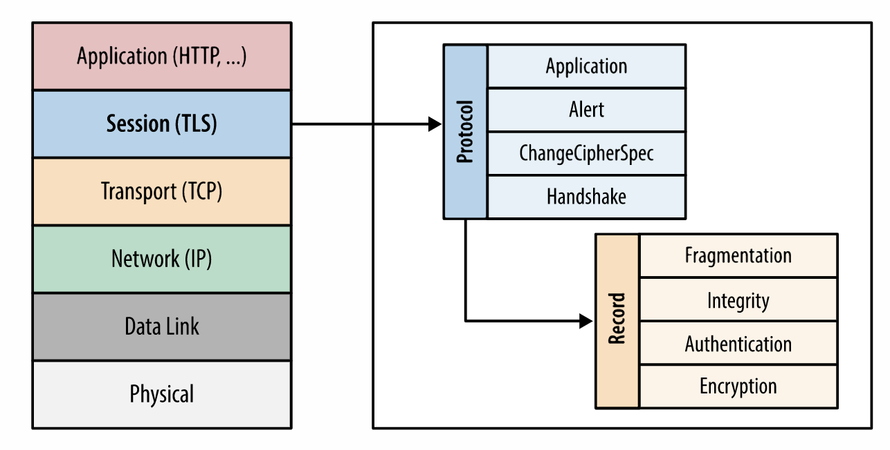

# 一文总结HTTP

## 介绍

`HTTP`,超文本传输协议，是一种能够获取如HTML这样的网络资源的协议。它是在Web上进行数据交换的基础，是一个client-server协议。一个完整的Web文档通常由多个不同的子文档组成，如下图所示：

`HTTP` 是应用层的协议，通过TCP/TLS来发送数据，最新的`HTTP 3.0`基于`UDP`, 叫做`QUIC`。

下图是`HTTP`涉及到的相关的下层协议和上层资源：

`HTTP`作为一个C-S协议，通常由客户端(通常是浏览器)发起一个 `request`，经过一些中间代理，到达服务器，服务器会返回一个 `response`，如下图所示：

`HTTP`的基本特性：

- 简单
- 可扩展
- 无状态，有会话

`HTTP`基础流程：

1. 打开一个TCP连接
2. 发送`HTTP`报文
3. 读取服务端返回的报文信息
4. 关闭连接或为后续请求重用连接

`HTTP` 支持的方法：

| 方法    | 是否幂等   | 作用                           | 数据          |
| ------- | ---------- | ------------------------------ | ------------- |
| GET     | 是         | 请求一个指定资源               | URL中的params |
| HEAD    | 是         | 与GET相同，只返回头部          | URL中的params |
| POST    | 否         | 将实体提交到指定的资源         | body中        |
| PUT     | 视情况而定 | 用于将实体替换指定的资源       | body中        |
| DELETE  | 是         | 删除指定资源                   | URL中的params |
| OPTIONS | 是         | 描述资源的通信选项             | 一般不需要    |
| TRACE   | 是         | 回环测试                       | /             |
| CONNECT | 是         | 建立一个到目标资源服务器的隧道 | /             |

## HTTP 的演进

## HTTP 消息格式

`HTTP消息`是服务器和客户端之间交换数据的方式，有两种类型：

- `request`: 客户端发送给服务器，用来触发服务器上的动作；
- `response`: 服务器的响应；

`HTTP消息`采用ASCII编码的多行文本组成，`HTTP/1.1`及之前的版本，消息通过公开的连接发送；

`HTTP/2`中，消息被分成多个`HTTP帧`。

### request格式

`request`的组成：

- 起始行：
  - HTTP方法；
  - 请求目标URI；
  - HTTP协议版本；
- Headers集合
- 一个空行后的Body

### response格式

`response`组成：

- 状态行：
  - 协议版本号；
  - 状态码；
  - 状态文本；
- Headers集合；
- 一个空行后的Body；

## HTTP的连接管理

### HTTP/1.x

如上图，有三种类型的连接：

- 短连接：每发起一个请求时都会创建一个新的连接，并在收到应答时关闭；
- 长连接：保持连接来完成多次连续的请求；
- 流水线模型：多个连续的请求不用等待返回就可以发送；类似redis的mget这种命令；

### HTTP/2.0

#### 多路复用

在`HTTP/1.x`中，浏览器客户端在同一时间，对同一个域名的请求数量有限制，超过限制数据的请求需要等待前面的请求完成后，才开始发送。所以，通过域名分片来提高并发。

多路复用允许同时通过单一的`HTTP/2.0` 连接发起多重的请求-响应消息。有了新的分帧机制后，`HTTP/2.0`  不再依赖多个TCP连接去实现多流并行了。每个数据流都拆分成很多互不依赖的帧，而这些帧可以交错（乱序发送），还可以分优先级，最后再在另一端把它们重新组合起来。

#### 头部压缩

`HTTP/1.x`的Headers带有大量信息，而且每次都要重复发送。`HTTP/2.0`使用encoder来减少需要传输的header大小，通讯双方各自缓存一份头部字段表，既避免了重复headers的传输，又减小了需要传输的大小。

`HTTP/2.0`的HPACK算法使用一份索引表来定义常用的Headers，把常用的HeadersHT存放在表里，请求的时候便只需要发送在表里的索引位置即可。完整的[索引文件](https://datatracker.ietf.org/doc/html/draft-ietf-httpbis-header-compression#appendix-A)：

### QUIC

`QUIC(Quick UDP Internet Connection)`，即使用UDP来实现`HTTP/2.0`。

用一个等式来表示就是：QUIC = UDP + TLS + HTTP2

基于TCP的HTTP存在的问题：

- TCP队头阻塞，停等问题；
- 握手延迟；
- 网络中间设备僵化；
- 协议僵化；

#### QUIC拥塞控制：

1. QUIC在应用层即可实现不同的拥塞控制算法，不需要改操作系统和内核。
2. 单个程序的不同连接也能支持配置不同的拥塞控制。这样我们就可以给不同的用户提供更好的拥塞控制。
3. 应用程序变更拥塞控制，甚至不需要停机和升级。
4. QUIC还有带宽预测，RTT监控，发送速率调整等高级算法支持。  

#### QUIC访问流程

一般情况下，Chrome浏览器和服务器端协商使用QUIC协议要经过如下步骤：

1. 首次访问，客户端发出正常的tcp请求
2. 服务端如果支持quic，会通过header返回alt-svc信息告知客户端自己支持QUIC
3. 下次访问，客户端同时发起tcp连接和QUIC连接竞速
4. 一旦quic竞速连接获胜，则后续会采用quic协议发送请求
5. 如遇网络或服务器不支持quic/udp，客户端标记quic为broken
6. 传输中的QUIC请求立即用tcp重发
7. 5min后尝试重试quic，下一次尝试增大到10min
8. 一旦再次成功采用quic并把broken标记取消

## HTTPS

`HTTP`的消息传输都是明文传输的，`HTTP/2.0`虽然使用了二进制，但仍然是明文，不过`HTTP/2.0`强制必须使用`HTTPS`。`HTTPS`就是在`HTTP`的基础上，加入`SSL(安全套阶层)`，后改名为`TLS(传输层安全)`。

`SSL/TLS`是位于`TCP/IP` 7层协议中的会话层，用于认证用户和服务器，加解密数据以及维护数据的完整性，确保数据在传输过程中不会被修改。

`TLS`主要由以下几个子协议组成，综合使用了对城加密、非对称加密、身份认证等多种技术。

- 记录协议；
- 握手协议；
- 警告协议；
- 变更密码规范协议；
- 扩展协议；

### 对称加密

对称加密就是加密和解密使用同一个密钥。对称加密无法保证密钥分发的安全性。

### 非对称加密

非对称加密由成对的公钥和私钥组成，公钥和私钥不相同，公钥可以给任何人使用。当前主要由DH、DSA、RSA和ECC等。

- RSA：它的安全性基于“整数分解”的数学难题，使用两个超大素数的乘积作为生成密钥的材料，想要从公钥推算出私钥是非常困难的；
- ECC：它基于“椭圆曲线离散对数”的数学难题，使用特定的曲线方程和基点生成公钥和私钥，子算法 ECDHE 用于密钥交换，ECDSA 用于数字签名；

### HTTPS连接过程

1. TCP三次握手建立连接；
2. Client发送"Hello"消息，包含Client的版本号、支持的密码套件和一个随机数；
3. Server验证是否支持对应的版本号和密码套件，返回"Hello"消息，包含版本号、选取的密码套件和一个随机数；
4. Server发送公钥证书和私钥签名；
5. Client端进行证书验证；
6. Client计算出pre-master，用公钥加密后，发送给Server；
7. Server解析出pre-master；
8. 后续Client和Server之间通信通过pre-master对称加密进行通信；

## 参考文档

1. https://developer.mozilla.org/zh-CN/docs/Web/HTTP
2. https://www.cnblogs.com/huansky/p/13977181.html
3. https://cloud.tencent.com/developer/article/1407615?from=information.detail.quic%E5%8D%8F%E8%AE%AE%E8%AF%A6%E8%A7%A3