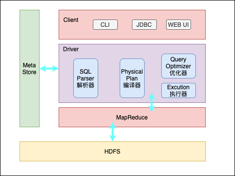

# Hive 入门

## 0. 前篇

因前面安装 `Hadoop` 时，使用了 `JDK 11`，但在使用 `Hive` 时，若仍用 `JDK 11` 会出现各种问题，所以在安装 `Hive` 时，需要将集群的的 `JDK` 版本替换为 `JDK 1.8` ，终于明白为啥 `1.8`为啥是网上所有文章推荐使用版本了。

### 0.1 JDK 1.8 替换（每台机器都需要修改，可配合使用 `ansible` 和 `rsync` 修改）

- 下载 `JDK 1.8` [[jdk-8u281-linux-x64.tar.gz](https://download.oracle.com/otn/java/jdk/8u281-b09/89d678f2be164786b292527658ca1605/jdk-8u281-linux-x64.tar.gz)]
- 解压

```sh
tar xzf jdk-8u281-linux-x64.tar.gz -C /opt/module/
```

- 修改 `JAVA_HOME`, 包括 `/etc/profile` 和 `hadoop`配置文件目录下的所有 `JAVA_HOME` 配置，最后需要执行 `source /etc/profile`

- 修改默认 `java` 和 `javac` 配置

  ```sh
  update-alternatives --install /usr/bin/java  java /opt/module/jdk1.8.0_281/bin/java 300
  update-alternatives --install /usr/bin/javac  javac /opt/module/jdk1.8.0_281/bin/javac 300
  update-alternatives --config java
  ```

## 1. Hive 介绍

### 1.1 什么是 Hive

一个用于解决海量结构化日志的数据统计系统，基于 `Hadoop` 的数据仓库工具，可以将结构化的数据文件映射为一张表，并提供了类 `SQL` 的查询功能。其底层会将 `SQL` 转换为 `MapReduce` 程序运行。它有以下几个重要功能：

- 通过 `SQL`来访问数据，并完成 `ETL`的任务
- 为各种形式的数据添加结构化信息，即映射为表
- 可以访问存放在 `HDFS` 或 `HBase` 上的数据
- 可以在 `Tez`、`Spark` 或 `MapReduce` 上执行查询
- `HPL-SQL`的过程语言
- 通过 `Hive LLAP`、`Yarn` 和 `Slider`实现亚秒级的查询
- 可通过用户代码实现诸如 `UDFS`/ `UDAFS`/ `UDTFS` 来扩展 `Hive SQL`

### 1.2 优缺点

#### 1.2.1 优点

* 操作接口采用 `类SQL` 语法，提供快速开发能力(简单、易上手)
* 避免写 `MapReduce` 程序，减少开发人员的学习成本
* 执行延迟比较高，适用于数据分析中对实时性要求不高的场合
* 适合于处理大数据场景，小数据场合没有优势
* 支持用户自定义函数，可以根据需求实现自定义函数

#### 1.2.2 缺点

* 表达能力有限
  * 无法实现迭代算法
  * 数据挖掘方面不擅长，底层是 `MapReduce`，效率更高的算法无法实现
* 效率低
  * `Hive` 底层是自动生成的 `MapReduce` 作业，依靠模版自动生成，不够智能化
  * `Hive` 调优比较困难，力度较粗

### 1.3 Hive 架构



#### 1.3.1 组件介绍

* `CLI`/ `JDBC` / `WEB UI`: 用户操作接口
* `Metstore`: 元数据信息，用来存储文件信息到表结构的映射等关系，元数据默认使用 `derby`存储，但不支持并发连接，所以一般使用 `Mysql`存储；元数据的主要内容有以下几点：
  * 表基本信息：所属数据库，默认是 `default`，表的拥有者、表名、表注释，表的类型，表数据所在目录
  * 表结构化信息：字段及字段信息，分区字段
* `Driver`：包含解析器、编译器、执行器、优化器
  * 解析器：将 `SQL` 字符串转换成抽象语法树AST；
  * 编译器：将抽象语法树AST编译生成逻辑执行计划；
  * 优化器：对执行计划进行优化
  * 执行器：将优化后的执行计划转换成可以运行的无力计划，即 `MR程序`/ `Tez`/ `Spark`;

* `Hadoop`: `HDFS` 存储原始数据，`MapReduce`执行 `MR`,`Yarn`负责调度；

#### 1.3.2 执行流程图


### 1.4 与数据库比较

| 查询语言     | HQL                | SQL                    |
| ------------ | ------------------ | ---------------------- |
| 数据存储位置 | HDFS               | Raw Device 或 Local FS |
| 数据格式     | 多种多样，用户定义 | 系统决定               |
| 数据更新     | 不支持             | 支持                   |
| 索引         | 无                 | 有                     |
| 执行         | MapReduce          | Executor               |
| 执行延迟     | 高                 | 低                     |
| 可扩展性     | 高                 | 低                     |
| 数据规模     | 大                 | 小                     |


## 2.  Hive 安装

### 1.1 安装

- 下载 `Hive`

- 解压

  ```sh
  tar xzvf apache-hive-3.1.2-bin.tar.gz -C /opt/module
  cd /opt/module && mv apache-hive-3.1.2-bin/ hive
  ```

- 编辑 `conf/hive-env.sh.template` 文件，添加如下内容，并重命名为 `conf/hive-env.sh`

  ```sh
  export HADOOP_HOME=/opt/module/hadoop
  export HIVE_CONF_DIR=/opt/module/hive/conf
  ```

- 创建目录

  ```sh
  hdfs dfs -mkdir /tmp
  hdfs dfs -mkdir -p /user/hive/warehouse
  hdfs dfs -chmod g+w /tmp
  hdfs dfs -chmod g+w /user/hive/warehouse
  ```

- 替换 `guava` 包，与 `hadoop` 保持一致

  ```sh
  cd /opt/module/hive && rm lib/guava-19.0.jar
  cp /opt/module/hadoop/share/hadoop/common/lib/guava-27.0-jre.jar lib/
  ```

### 1.2 使用mysql存储元数据

- 安装 `mysql-server`

  ```sh
  apt update
  apt install -y mysql-server
  mysql_secure_installation # 按要求配置mysql
  ```

- 配置 `mysql` 用户

  ```sql
  create user 'root'@'%' identified by '12341234';
  grant all privileges on *.* to 'root'@'%';
  flush privileges;
  ```

- 修改 `/etc/mysql/mysql.conf.d/mysqld.cnf` 文件，将 `bind-address` 修改为 `0.0.0.0`

  ```conf
  bind-address		= 0.0.0.0
  ```

- 修改 `hive` 配置使用 `mysql` 存储元数据

  ```xml
  <?xml version="1.0"?>
  <?xml-stylesheet type="text/xsl" href="configuration.xsl"?>
  <configuration>
  	<property>
  		<name>javax.jdo.option.ConnectionURL</name>
  		<value>jdbc:mysql://ubuntu001:3306/metastore?createDatabaseIfNotExist=true</value>
  		<description>JDBC connect string for a JDBC metastore</description>
  	</property>
  	<property>
  		<name>javax.jdo.option.ConnectionDriverName</name>
  		<value>com.mysql.jdbc.Driver</value>
  		<description>Driver class name for a JDBC metastore</description>
  	</property>
  	<property>
  		<name>javax.jdo.option.ConnectionUserName</name>
  		<value>root</value>
  		<description>username to use against metastore database</description>
  	</property>
  	<property>
  		<name>javax.jdo.option.ConnectionPassword</name>
  		<value>12341234</value>
  		<description>password to use against metastore database</description>
    </property>
    <property>
  		<name>hive.metastore.schema.verification</name>
  		<value>false</value>
  	</property>
  	<property>
  		<name>hive.metastore.event.db.notification.api.auth</name>
  		<value>false</value>
  	</property>
  </configuration>
  ```

  - 添加 `mysql` 客户端 `JAR` 包

    ```sh
    dpkg -X mysql-connector-java_8.0.23-1ubuntu20.04_all.deb  .
    cp usr/share/java/mysql-connector-java-8.0.23.jar /opt/module/hive/lib/
    ```

    

- 初始化元数据

  ```sh
  bin/schematool -initSchema -dbType mysql -verbose
  ```

### 1.3 测试

使用 `Mysql` 存储元数据，就可以在多窗口运行 `hive` 命令后程序了，使用默认的 `Derby` 是无法多窗口运行的

```sh
bin/hive
show databases;
```

### 1.4 Hive 配套组件

#### 1.4.1  `hiveserver2` 相关配置

-  `Hadoop` 配置文件 `core-site.xml` 修改，添加如下配置

  ```xml
  <property>
      <name>hadoop.proxyuser.hadoop.hosts</name>
      <value>*</value>
  </property>
  <property>
      <name>hadoop.proxyuser.hadoop.groups</name>
      <value>*</value>
  </property>
  ```

- `Hive` 配置文件 `hive-site.xml` 文件修改, 添加如下配置

  ```xml
  <property>
  		<name>hive.server2.thrift.port</name>
  		<value>10000</value>
  </property>
  <property>
  		<name>hive.server2.thrift.address</name>
  		<value>ubuntu001</value>
  </property>
  <property>
  		<name>hive.server2.enable.doAs</name>
  		<value>false</value>
  </property>
  ```

- 启动 `hiveserver2` 服务

  ```sh
  bin/hiveserver2
  ```

- 启动 `bin/beeline`

  ```sh
  bin/beeline -u jdbc:hive2://ubuntu001:10000/default hawick
  0: jdbc:hive2://ubuntu001:10000/default> show tables;
  INFO  : Compiling command(queryId=hawick_20210410082108_f38f8d53-ef19-4c79-b359-f64f398c5a1c): show tables
  INFO  : Concurrency mode is disabled, not creating a lock manager
  INFO  : Semantic Analysis Completed (retrial = false)
  INFO  : Returning Hive schema: Schema(fieldSchemas:[FieldSchema(name:tab_name, type:string, comment:from deserializer)], properties:null)
  INFO  : Completed compiling command(queryId=hawick_20210410082108_f38f8d53-ef19-4c79-b359-f64f398c5a1c); Time taken: 1.206 seconds
  INFO  : Concurrency mode is disabled, not creating a lock manager
  INFO  : Executing command(queryId=hawick_20210410082108_f38f8d53-ef19-4c79-b359-f64f398c5a1c): show tables
  INFO  : Starting task [Stage-0:DDL] in serial mode
  INFO  : Completed executing command(queryId=hawick_20210410082108_f38f8d53-ef19-4c79-b359-f64f398c5a1c); Time taken: 0.075 seconds
  INFO  : OK
  INFO  : Concurrency mode is disabled, not creating a lock manager
  +-----------+
  | tab_name  |
  +-----------+
  +-----------+
  No rows selected (1.687 seconds)
  ```

## 3. 常见配置

### 3.1 Hive 数据仓库位置配置

`Default` 数据仓库的最原始位置是在 `HDFS` 上的 `/user/hive/warehouse` 目录下。`HDFS`上没有为数据库 `default` 创建文件夹，当在 `default` 下创建表时，会直接在数据仓库目录下创建一个文件夹。若要修改 `default` 数据仓库的原始位置，可通过如下配置修改:  (该配置可以从 `hive-default.xml.template` 中拷贝)

```xml
<property>
  <name>hive.metastore.warehouse.dir</name>
  <value>/user/hive/warehouse</value>
  <description>location of default database for the warehouse</description>
</property>
```

配置同组用户有执行权限：

```sh
hdfs dfs -chmod g+w /user/hive/warehouse
```

### 3.2 结果信息显示配置

在 `hive-site.xml`添加如下配置，显示当前数据库和表头信息

```xml
<property>
    <name>hive.cli.print.current.db</name>
    <value>true</value>
    <description>Whether to include the current database in the Hive prompt.</description>
</property>
<property>
    <name>hive.cli.print.header</name>
    <value>true</value>
    <description>Whether to print the names of the columns in query output.</description>
</property>
```

### 3.3 运行日志配置

`Hive` 的运行日志默认存放在 `/tmp/hawick/hive.log` 目录下，修改 `Hive` 的日志存放目录为 `/opt/module/hive/logs`。创建 `hive-log4j-properties` 文件，并修改 `hive.log.dir` 配置：

```sh
mv conf/hive-log4j2.properties.template conf/hive-log4j2.properties
property.hive.log.dir = /opt/module/hive/log
```

### 3.4 参数配置方式

#### 3.4.1 查看当前所有的配置信息，或特定项的配置信息

```sh
hive (default)> set;
hive (default)> set hive.cli.print.header;
hive.cli.print.header=true
```

#### 3.4.2 参数配置的三种方式，优先级依次递增

1. 配置文件

   * 默认配置文件：`hive-default.xml`，`conf`目录下只有 `template`文件，其内容都是默认配置， `hive`虽然没有使用该文件，但默认值均已集成；
   * 用户自定义文件：`hive-site.xml`，自定义配置会覆盖默认配置。`Hive`也会读入 `Hadoop`配置，`Hive`的配置也会覆盖 `Hadoop`的配置；

2. 命令行参数，启动 `bin/hive`时，可以添加 `--hiveconf param=value` 来设置；

3. 命令行内参数声明，运行 `bin/hive`过程中，可以在 `HQL`上通过 `set`来设定参数

   ```sh
   hive (default)> set hive.cli.print.header=false;
   hive (default)> set hive.cli.print.header;
   hive.cli.print.header=false
   ```

