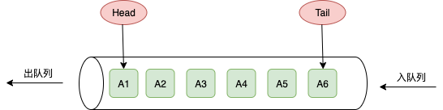
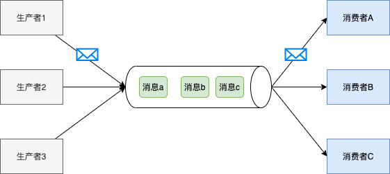
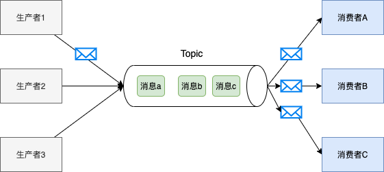
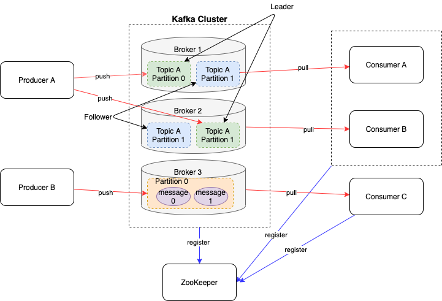

# Kafka 入门

## 1. 概述

### 1.1 什么是消息队列

消息队列，英文名 `Message Queue(MQ)`，学过数据结构的我们都知道，队列是一个 `FIFO(先进先出)` 的数据结构，如下图所示：



消息队列就是类似队列的一个单独服务，它可以认为就是将我们的各个服务之间需要流动的数据(消息），放到一个单独的队列服务中(不再是日常业务中某个进程的内存中），常见的有 `Redis`、`RocketMQ`、`Kafka`等；

消息队列除了队列之外，还有另外两种关联对象：
- 生产者: 向队列中添加/发送消息的的服务；
- 消费者: 从队列中拉取/消费消息的服务；

### 1.2 消息队列类型

#### 1.2.1 点对点模式

一对一，消费者主动拉取数据，消息收到后，该消息在队列中被删除；
这种模型通常是基于拉取或轮询的消息传送模型，它从队列中请求消息，而不是将消息推送到消费者进程。这种模型的特点是队列中的消息被一个且只有一个接收者处理，被处理后即删除。即使有多个消费者监听它时，也是如此；



#### 1.2.2 发布/订阅模式

一对多，生产者生产消息到消息队列后，消息队列服务将它推送给所有订阅者；
发布/订阅模式是一个基于推送的消息传送模型。发布订阅模型可以有多种不同的订阅者，临时订阅者只在主动监听主题时才接收消息，而持久订阅者则监听主题的所有消息，即使当前订阅者不可用，处于离线状态。



### 1.3 为什么需要消息队列

1. 解偶: 从前一节中消息队列模型的两种模式中，我们可以看到两种模式中，生产者和消费者都没有直接依赖，而是通过一个中间的消息队列进行通信；所以我们可以独立的修改或扩展两边的服务逻辑，只需要确保两边遵循同样的接口约束即可；
2. 扩展性: 通过两边服务的解偶，我们可以对两边的服务进行单独扩展，如增大消息入队处理或是增大消息出队的处理，只需要扩展对应服务的进程数即可；
3. 削峰: 当前互联网环境里，有许多促销或者发布会，会导致业务流量短时间达到平常时间的几倍几十倍。这时,进程可能直接会被这些突增流量给搞垮。通过消息队列，生产者将消息存入消息队列，生产者根据自身的消费速度从消息队列中获取消息进行消费，即可以保证服务的高可用性；(当然，如果你的业务拆分不合理，在生产者那即被突增流量搞垮，那消息队列也起不了作用);
4. 异步通信: 消息队列通常都提供了异步处理机制，生产者将消息放入队列后，消费者可以异步消费，不同的消费进程之间互不影响；
5. 顺序保证: 在大多使用场景下，数据处理的顺序都很重要。大部分消息队列本来就是排序的，并且能保证数据会按照特定的顺序来处理。(Kafka 保证一个 Partition 内的消息的有序性)

### 1.4 Kafka 是什么

在流式计算中，Kafka 一般用来缓存数据，Storm 通过消费 Kafka 的数据进行计算。

- Apache Kafka 是一个`开源消息系统`，由 Java & Scala 写成。是由 Apache 软件基金会开发的 一个开源消息系统项目。
- Kafka 最初是由 LinkedIn 公司开发，并于2011年初开源。2012年10月从 Apache Incubator 毕业。该项目的目标是`为处理实时数据提供一个统一、高通量、低等待`的平台。
- Kafka 是一个`分布式消息队列`。Kafka 保存消息时根据 `Topic` 进行归类，`发送消息`的服务是 `Producer`，`消费消息`的服务是 `Consumer`，此外 kafka 集群由多个 kafka 实例组成，每个 实例(server)称为 `broker`。
- 无论是 kafka 集群，还是 consumer 都依赖于 `zookeeper` 集群保存一些 `meta 信息`， 来保证系统高可用性。

### 1.5 Kafka 架构

### 架构图


### 组件解释
1. `Broker`: Kafka处理节点(服务器)，一个处理节点就是一个 `Broker`, 一个 Kafka 集群由一个或多个 `Broker` 组成；
2. `Producer`：生产者，负责将消息发送到 `Broker`;
3. `Consumer`: 消费者，负责从 `Borker` 读取消息；
4. `ConsumerGroup`: 每个 `consumer` 属于一个特定的 `ConsumerGroup`，可为每个 `consumer` 指定 `group name`，若不指定，则属于默认的 `group`，一条消息可以发送到不同的`consumer group`，但一个`ConsumerGroup` 中只能有一个 `consumer` 能消费这条消息;
5. `Topic`: Kafka对消息进行归类，发送到集群的每一条消息都要指定一个 `Topic`;
6. `Partiton`: 物理上的概念，每个`Topic`包含一个或多个`Partition`，一个`Partition`对应一个文件夹，这个文件夹下存储`Partition`的数据和索引文件，每个`Partition`内部是有序的;
7. `Offset`: kafka 的存储文件都是按照 `xxxxxxx.kafka(xxxxx表示offset)` 来命名，用 `Offset` 做名字的好处是方便查找。例如你想找位于 2049 的位置，只要找到 2048.kafka 的文件即可。当然`Topic`最开始的消息文件就是 `00000000000.kafka`;

## 2. 安装

### 2.1 环境准备

#### 2.1.1 集群规划

| ubuntu001  | ubuntu002  | ubuntu003  |
| ---------- | ---------- | ---------- |
| zookeeper0 | zookeeper1 | zookeeper2 |
| kafka0     | kafka1     | kafka2     |

#### 2.1.2 安装包下载(所有机器均需配置，可配合使用 rsync 和 ansible)

- 下载链接：[kafka_2.13-2.7.0.tgz](https://www.apache.org/dyn/closer.cgi?path=/kafka/2.7.0/kafka_2.13-2.7.0.tgz)

- 解压，重命名，创建日志目录

  ```sh
  tar xzf kafka_2.13-2.7.0.tgz -C /opt/module/
  cd /opt/module && mv kafka_2.13-2.7.0-src/ kafka
  cd kafka && mkdir logs 
  ```

- 修改配置文件 `config/server.properties`

  ```properties
  # The id of the broker. This must be set to a unique integer for each broker.
  broker.id=0 # ubuntu002设置为1，ubuntu003 设置为2
  
  # enable delete topic
  delete.topic.enable=true
  
  # A comma separated list of directories under which to store log files
  log.dirs=/opt/module/kafka/logs
  
  # Zookeeper connection string (see zookeeper docs for details).
  # This is a comma separated host:port pairs, each corresponding to a zk
  # server. e.g. "127.0.0.1:3000,127.0.0.1:3001,127.0.0.1:3002".
  # You can also append an optional chroot string to the urls to specify the
  # root directory for all kafka znodes.
  zookeeper.connect=ubuntu001:2181,ubuntu002:2181,ubuntu003:2181
  ```

- 配置环境变量 `/etc/profile`, 然后 `source /etc/profile`

  ```sh
  #KAFKA_HOME
  export KAFKA_HOME=/opt/module/kafka
  export PATH=$PATH:$KAFKA_HOME/bin
  ```

- 启动集群

  ```sh
  bin/kafka-server-start.sh config/server.properties &
  ```

- 关闭集群

  ```sh
  bin/kafka-server-start.sh config/server.properties &
  ```

#### 2.1.3 测试

- 查看 `topic`:

  ```sh
  kafka-topics.sh --zookeeper ubuntu001:2181 --list
  ```

- 创建 `topic`:

  ```sh
  kafka-topics.sh --zookeeper ubuntu001:2181 --create --replication-factor 3 --partitions 1 --topic first-topic
  ```

- 删除 `topic`:

  ```sh
  kafka-topics.sh --zookeeper ubuntu001:2181 --delete --topic first-topic
  ```

- 发送消息

  ```sh
  kafka-console-producer.sh --broker-list ubuntu001:9092 --topic first-topic
  >hello
  >
  ```

- 消费消息

  ```sh
  kafka-console-consumer.sh --bootstrap-server ubuntu002:9092 --from-beginning --topic first-topic
  hello
  ```

  

- 查看 `topic` 详情信息

  ```sh
  kafka-topics.sh --zookeeper ubuntu001:2181 --describe --topic first-topic
  Topic: first-topic	PartitionCount: 1	ReplicationFactor: 3	Configs:
  	Topic: first-topic	Partition: 0	Leader: 1	Replicas: 1,2,0	Isr: 1,2,0
  ```

  
