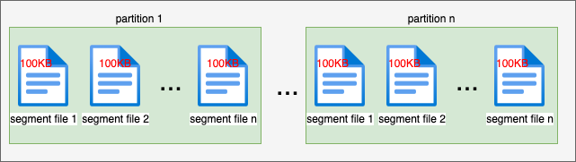

# Kafka 工作原理

## 1. 写流程

### 1.1 流程图


### 1.2 步骤

1. `Producer` 连接 `ZooKeeper` 集群，根据 `topic` ，获取分区信息和 `Leader`信息(`/brokers/topics/first-topic/partitions/0/state`)；
2. `ZooKeeper` 返回`Leader` 信息；
3. `Producer` 向 `Leader`发送数据；
4. 其他 `Follower` 从 `Leader` 上复制数据；
5. `Follower` 依次返回确认 `ACK` 信息；
6. `Leader` 收到所有 `ISR` 中的确认信息，发送 `ACK` 给 `Producer`, 数据完成提交，写过程结束。

## 2. 存储机制

### 2.1 Topic 中 Partition 的存储分布

- 如何指定 `Partition`

  - 创建 `topic` 时指定：

    ```sh
    # 下面指定分区数为 6
    kafka-topics.sh --zookeeper ubuntu001:2181 --create --replication-factor 3 --partitions 6 --topic first-topic
    ```

  - `server.properties` 配置文件设置默认`Partition`数目：

    ```properties
    # The default number of log partitions per topic. More partitions allow greater
    # parallelism for consumption, but this will also result in more files across
    # the brokers.
    num.partitions=3
    ```

- `Broker` 中如何存储 `Partition`

  - `server.properties` 配置文件中设置数据存储目录：

    ```properties
    # A comma separated list of directories under which to store log files
    # log.dirs=/tmp/kafka-logs
    log.dirs=/opt/module/kafka/logs
    ```

  - `Partition` 在目录下的存储形式；因为这里时3个`Broker`和3个副本，所以每台机器都会有所有分区的副本。每个 `Partition` 一个目录，名称为 `{topic-name}-{partition-sequence-number}` 

    ```sh
    ls -al | grep first-topic
    drwxrwxr-x  2 hawick hawick   4096 Apr 14 07:38 first-topic-0
    drwxrwxr-x  2 hawick hawick   4096 Apr 14 07:38 first-topic-1
    drwxrwxr-x  2 hawick hawick   4096 Apr 14 07:38 first-topic-2
    drwxrwxr-x  2 hawick hawick   4096 Apr 14 07:38 first-topic-3
    drwxrwxr-x  2 hawick hawick   4096 Apr 14 07:38 first-topic-4
    drwxrwxr-x  2 hawick hawick   4096 Apr 14 07:38 first-topic-5
    ```

  - 运行 `kafka-topics.sh --zookeeper ubuntu001:2181 --describe --topic first-topic` 查看分区信息和副本信息；

    ```sh
    # 副本分配规则
    # 将所有N Broker和待分配的i个Partition排序.
    # 将第i个Partition分配到第(i mod n)个Broker上.
    # 将第i个Partition的第j个副本分配到第((i + j) mod n)个Broker上.
    Topic: first-topic	PartitionCount: 6	ReplicationFactor: 3	Configs:
    Topic: first-topic	Partition: 0	Leader: 0	Replicas: 0,1,2	Isr: 0,1,2
    Topic: first-topic	Partition: 1	Leader: 1	Replicas: 1,2,0	Isr: 1,2,0
    Topic: first-topic	Partition: 2	Leader: 2	Replicas: 2,0,1	Isr: 2,0,1
    Topic: first-topic	Partition: 3	Leader: 0	Replicas: 0,2,1	Isr: 0,2,1
    Topic: first-topic	Partition: 4	Leader: 1	Replicas: 1,0,2	Isr: 1,0,2
    Topic: first-topic	Partition: 5	Leader: 2	Replicas: 2,1,0	Isr: 2,1,0
    ```

### 2.2 Partition 中文件的存储方式

```sh
# 通过脚本写入大量数据后
ls -alh logs/first-topic-0/
total 252K
drwxrwxr-x  2 hawick hawick 4.0K Apr 14 09:22 .
drwxrwxr-x 26 hawick hawick 4.0K Apr 14 09:22 ..
-rw-rw-r--  1 hawick hawick  184 Apr 14 09:19 00000000000000000000.index
-rw-rw-r--  1 hawick hawick  99K Apr 14 09:18 00000000000000000000.log
-rw-rw-r--  1 hawick hawick  300 Apr 14 09:19 00000000000000000000.timeindex
-rw-rw-r--  1 hawick hawick   88 Apr 14 09:22 00000000000000000963.index
-rw-rw-r--  1 hawick hawick  99K Apr 14 09:22 00000000000000000963.log
-rw-rw-r--  1 hawick hawick  132 Apr 14 09:22 00000000000000000963.timeindex
-rw-rw-r--  1 hawick hawick  10M Apr 14 09:22 00000000000000003216.index
-rw-rw-r--  1 hawick hawick  16K Apr 14 09:22 00000000000000003216.log
-rw-rw-r--  1 hawick hawick   10 Apr 14 09:22 00000000000000003216.snapshot
-rw-rw-r--  1 hawick hawick  10M Apr 14 09:22 00000000000000003216.timeindex
-rw-rw-r--  1 hawick hawick   26 Apr 14 09:16 leader-epoch-checkpoint
```

- `server.properties` 配置文件中设置`segment`文件大小：

```properties
# The maximum size of a log segment file. When this size is reached a new log segment will be created.
log.segment.bytes=102400
```

* 分区文件存储如下图所示，每个 `Partition` (目录)下会存储多个 `segment` 文件，每个`segment`的大小由配置文件指定，但消息数量不一定相等；

  

  

### 2.3 Partition 中 Segment 文件存储结构

`2.2`中我们介绍了 `Partition`中的以目录和其下的 `segment` 文件形式来存储。现在我们就深入到 `segment` 文件，研究 `segment` 如何存储消息，才能实现O(1)的时间读写数据。

由 `2.2` 中`Partition`目录下的文件方式，我们可以知道，`segment` 文件主要有两部分组成（索引文件和数据文件一一对应，成对出现）：

- `segment log file`： 数据文件，存储真正的消息数据

- `segment index file`: 索引文件，存储消息 `offset` 到 `log file` 的文件物理偏移；

  

`segment log file` 中消息的存储格式：

```java
		baseOffset: int64 
		batchLength: int32
		partitionLeaderEpoch: int32
		magic: int8 (current magic value is 2)
		crc: int32
		attributes: int16
			bit 0~2:
				0: no compression
				1: gzip
				2: snappy
				3: lz4
				4: zstd
			bit 3: timestampType
			bit 4: isTransactional (0 means not transactional)
			bit 5: isControlBatch (0 means not a control batch)
			bit 6~15: unused
		lastOffsetDelta: int32
		firstTimestamp: int64
		maxTimestamp: int64
		producerId: int64
		producerEpoch: int16
		baseSequence: int32
		records: [Record]
```

`recode`  的格式

```java
		length: varint
		attributes: int8
			bit 0~7: unused
		timestampDelta: varint
		offsetDelta: varint
		keyLength: varint
		key: byte[]
		valueLen: varint
		value: byte[]
		Headers => [Header]
```

`Header` 的格式

```java
		headerKeyLength: varint
		headerKey: String
		headerValueLength: varint
		Value: byte[]
```


### 2.4 如何在 Partition 中通过 Offset 查找对应的 Message

按照 `2.2` 中的`log file` 和 `index file` 图，假设要读取`offset=2048`的`message`，需要通过下面2个步骤查找。

- 第一步查找`segment index file`，其中`00000000000000000000.index`表示最开始的文件，起始偏移量(offset)为0；第二个文件`00000000000000000963.index`的消息量起始偏移量为`963+1=964`。同样，第三个文件`00000000000000003216.index`的起始偏移量为`3216+1=3217`，其他后续文件依次类推，以起始偏移量命名并排序这些文件，只要根据offset **二分查找**文件列表，就可以快速定位到具体文件。 当`offset=2048`时定位到`00000000000000000963.index|log`
- 第二步通过`segment index file`查找`offset=2048` 最接近的消息，找到对应的`00000000000000000963.index`的元数据物理位置和`00000000000000000963.log`的物理偏移地址，然后再通过`00000000000000000963.log`顺序查找直到`offset=2048`为止。

### 2.5 Broker 数据保存和删除

无论消息是否被消费，`Kafka`都会保留所有消息；但是可以配置数据的保留时间，有以下两个方式：

```properties
# The minimum age of a log file to be eligible for deletion due to age
# 数据保存时间
log.retention.hours=168

# A size-based retention policy for logs. Segments are pruned from the log unless the remaining
# segments drop below log.retention.bytes. Functions independently of log.retention.hours.
# 数据保存大小
log.retention.bytes=107374182
```

## 3. 消费过程

`Kafka`采用 `pull` 模型，由消费者自己记录消费状态，每个消费者互相独立地顺序读取每个分区的消息。

如下图所示，有两个消费者（不同消费者组）拉取同一个主题的消息，消费者A的消费进度是3，消费者B的消费进度是6。消费者拉取的最大上限通过最高水位（watermark）控制，生产者最新写入的消息如果还没有达到备份数量，对消费者是不可见的。

这种由消费者控制偏移量的优点是：消费者可以按照任意的顺序消费消息。比如，消费者可以重置到旧的偏移量，重新处理之前已经消费过的消息；或者直接跳到最近的位置，从当前的时刻开始消费。


## 4. 副本机制

副本即是数据的备份，对应的 `Kafka` 就是 `Partition`的备份。副本机制提供的好处有：

- 冗余
- 高可用
- 改善数据局部性

#### 4.1 Kafka 副本存储

由 `2.1` 和 `2.2` 我们知道，`Kafka` 的数据按 `Partition` 分块存储。对于每个 `Partition`，`Kafka`会根据配置的副本因子来创建副本数据，`2.1` 提过的副本放置策略：

1. 将所有N Broker和待分配的i个Partition排序.
2. 将第i个Partition分配到第(i mod n)个Broker上.
3. 将第i个Partition的第j个副本分配到第((i + j) mod n)个Broker上.


#### 4.2 副本一致性

在 `Kafka` 中，副本分为两类：`Leader副本` 和 `Follower副本`。每个 `Partition` 在创建的时候都要选举一个副本作为 `Leader副本`, 其余的副本自动成为 `Follower副本`。

- `Leader副本`: 对外提供服务，接收所有请求并处理；
- `Follower副本`: 从 `Leader副本`中同步消息，写入自己的日志中，保持与 `Leader副本` 的同步；当 `Leader副本`不可服务时，会从 `Follower副本` 中选举新的`Leader副本`；而旧的`Leader副本`重启后也只能以`Follower`的角色加入集群。


`Kafka` 中副本一致性的实现有以下两个好处：

1. 实现 `Read-Your-Writes`：由于只有 `Leader副本`对外提供服务，所以当我执行完`write` 成功后，`read`可以返回刚刚 `write`成功的消息；
2. 实现单调读：单调读就是消费者在多次读取消息的时候，不会看到一条消息一会存在一会不存在。

#### 4.3 ISR ( In-sync Replicas )

`4.2`中提到了 `Follower副本` 会异步去同步 `Leader副本`的消息; `1.1` 中的写流程中，也提到了只要 `ISR`中的`Broker`返回了所有的副本`ACK`，才算消息提交完成。这个 `ISR` （同步副本集合）中的副本都是与`Leader副本`同步的副本（包含`Leader 副本`)，而不在`ISR`中的副本都是不同步的。

- `Leader副本`会维护一个与其保持基本同步的`Relica`列表，该列表即为 `ISR`。每个`Partition`都会有一个`ISR`。

- 当一个`Follower副本` 超过一段时间没有给`Leader副本` 发送复制请求，则该`Follower`会从`ISR`中移除；
- 当 `ISR` 中的所有`Replica`都向 `Leader` 发送了`ACK`时，`Leader`才commit;

`ISR`相关配置：

```properties
# If a follower hasn't sent any fetch requests or hasn't consumed up to the leaders log end offset for at least this time, the leader will remove the follower from isr
replica.lag.time.max.ms=30000
# 保证 ISR 中至少有多少个replica
min.insync.replicas=1
```

## 5. Zookeeper存储结构

