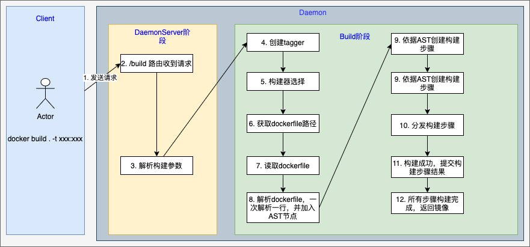

# Docker Build 源码学习

我们在使用Docker时，经常做的事情有`docker build` 、`docker run`，今天先从docker的源码看看`docker build`的流程。

先使用`docker build --help`查看一下帮助文档，了解支持的功能

```shell
Usage:  docker build [OPTIONS] PATH | URL | -

Build an image from a Dockerfile

Options:
      --add-host list           Add a custom host-to-IP mapping (host:ip)
      --build-arg list          Set build-time variables
      --cache-from strings      Images to consider as cache sources
      --disable-content-trust   Skip image verification (default true)
  -f, --file string             Name of the Dockerfile (Default is 'PATH/Dockerfile')
      --iidfile string          Write the image ID to the file
      --isolation string        Container isolation technology
      --label list              Set metadata for an image
      --network string          Set the networking mode for the RUN instructions during build (default "default")
      --no-cache                Do not use cache when building the image
  -o, --output stringArray      Output destination (format: type=local,dest=path)
      --platform string         Set platform if server is multi-platform capable
      --progress string         Set type of progress output (auto, plain, tty). Use plain to show container
                                output (default "auto")
      --pull                    Always attempt to pull a newer version of the image
  -q, --quiet                   Suppress the build output and print image ID on success
      --secret stringArray      Secret file to expose to the build (only if BuildKit enabled):
                                id=mysecret,src=/local/secret
      --ssh stringArray         SSH agent socket or keys to expose to the build (only if BuildKit enabled)
                                (format: default|<id>[=<socket>|<key>[,<key>]])
  -t, --tag list                Name and optionally a tag in the 'name:tag' format
      --target string           Set the target build stage to build.
```

下面是整个流程的简介图



当我们在终端执行命令`docker build . -t xxx:xxx`的时候，docker 的client 会发送信息到docker daemon的后端进程中，所以我们从docker daemon后端中的路由解析开始。

1. 先初始化路由

```go
// api/server/router/build/build.go
func (r *buildRouter) initRoutes() {
	r.routes = []router.Route{
		router.NewPostRoute("/build", r.postBuild), // 初始化build的路由
		router.NewPostRoute("/build/prune", r.postPrune),
		router.NewPostRoute("/build/cancel", r.postCancel),
	}
}
```

2. 解析参数，解析参数就是解析我们命令行的传过来的参数

```go
// api/server/router/build/build.go
func (br *buildRouter) postBuild(ctx context.Context, w http.ResponseWriter, r *http.Request, vars map[string]string) error {
  ...
  // 解析参数
  buildOptions, err := newImageBuildOptions(ctx, r)
	if err != nil {
		return errf(err)
	}
	buildOptions.AuthConfigs = getAuthConfigs(r.Header)
  ...
  // 执行build，返回镜像ID
  imgID, err := br.backend.Build(ctx, backend.BuildConfig{
		Source:         body,
		Options:        buildOptions,
		ProgressWriter: buildProgressWriter(out, wantAux, createProgressReader),
	})
}
  
```

3. 进入build查看内部逻辑，

```go
// api/server/backend/build/backend.go
func (b *Backend) Build(ctx context.Context, config backend.BuildConfig) (string, error) {
	...
  // 创建标签器，
  tagger, err := NewTagger(b.imageComponent, config.ProgressWriter.StdoutFormatter, options.Tags)
	if err != nil {
		return "", err
	}
  // 创建builer，buildKit是新一代的构建技术，允许我们挂载依赖、密钥文件等到构建过程，但最终的镜像不包含
  var build *builder.Result
	if useBuildKit {
		build, err = b.buildkit.Build(ctx, config)
		if err != nil {
			return "", err
		}
	} else {
		build, err = b.builder.Build(ctx, config)
		if err != nil {
			return "", err
		}
	}
```

4. 我们先看普通的builder的Build

```go
// builder/dockerfile/builder.go
func (bm *BuildManager) Build(ctx context.Context, config backend.BuildConfig) (*builder.Result, error) {
  ...
  // 获取dockerfile解析后的语法树,检测dockerfile路径，并解析
  source, dockerfile, err := remotecontext.Detect(config)
  ...
  // 获取语法树后，进入内部的build stage，其中逻辑从第7步开始
  return b.build(source, dockerfile)
}


```

5. 读取dockerfile

```go
// builder/remotecontext/detect.go
func Detect(config backend.BuildConfig) (remote builder.Source, dockerfile *parser.Result, err error) {
  switch {
	case remoteURL == "": // 本地dockerfile
		remote, dockerfile, err = newArchiveRemote(config.Source, dockerfilePath)
	case remoteURL == ClientSessionRemote:
		return nil, nil, errdefs.InvalidParameter(errors.New("experimental session with v1 builder is no longer supported, use builder version v2 (BuildKit) instead"))
	case urlutil.IsGitURL(remoteURL): // git dockerfile
		remote, dockerfile, err = newGitRemote(remoteURL, dockerfilePath)
	case urlutil.IsURL(remoteURL): // 其它远程 dockerfile
		remote, dockerfile, err = newURLRemote(remoteURL, dockerfilePath, config.ProgressWriter.ProgressReaderFunc)
	default:
		err = fmt.Errorf("remoteURL (%s) could not be recognized as URL", remoteURL)
	}
}
//分析本地dockerfile类型，5中的newArchiveRemote会返回下面函数的结果
func withDockerfileFromContext(c modifiableContext, dockerfilePath string) (builder.Source, *parser.Result, error) {
  ...
  // 读取dockerfile并解析
  res, err := readAndParseDockerfile(dockerfilePath, df)
	if err != nil {
		return nil, nil, err
	}
  ...
}
//
func readAndParseDockerfile(name string, rc io.Reader) (*parser.Result, error) {
  ...
  // 创建reader，从索引1处开始读取
  dockerfile, err := parser.Parse(br)
	if err != nil {
		return nil, errdefs.InvalidParameter(errors.Wrapf(err, "failed to parse %s", name))
	}
  return dockerfile, nil
}
```

6. 解析dockerfile

```go
// github.com/moby/buildkit/frontend/dockerfile/parser/parser.go
func Parse(rwc io.Reader) (*Result, error) {
	d := newDefaultDirectives()
	currentLine := 0
  // 语法树结果
	root := &Node{StartLine: -1}
	scanner := bufio.NewScanner(rwc)
	warnings := []string{}
	var comments []string

	var err error
	for scanner.Scan() {
		bytesRead := scanner.Bytes()
		if currentLine == 0 {
			// First line, strip the byte-order-marker if present
			bytesRead = bytes.TrimPrefix(bytesRead, utf8bom)
		}
    // 提取注释
		if isComment(bytesRead) {
			comment := strings.TrimSpace(string(bytesRead[1:]))
			if comment == "" {
				comments = nil
			} else {
				comments = append(comments, comment)
			}
		}
    // 处理一行
		bytesRead, err = processLine(d, bytesRead, true)
		if err != nil {
			return nil, withLocation(err, currentLine, 0)
		}
		currentLine++

		startLine := currentLine
		line, isEndOfLine := trimContinuationCharacter(string(bytesRead), d)
    // 如果文件尾货空行，则继续scan循环
		if isEndOfLine && line == "" {
			continue
		}

		var hasEmptyContinuationLine bool
    // 这里还要一个循环是为啥？
		for !isEndOfLine && scanner.Scan() {
			bytesRead, err := processLine(d, scanner.Bytes(), false)
			if err != nil {
				return nil, withLocation(err, currentLine, 0)
			}
			currentLine++

			if isComment(scanner.Bytes()) {
				// original line was a comment (processLine strips comments)
				continue
			}
			if isEmptyContinuationLine(bytesRead) {
				hasEmptyContinuationLine = true
				continue
			}

			continuationLine := string(bytesRead)
			continuationLine, isEndOfLine = trimContinuationCharacter(continuationLine, d)
			line += continuationLine
		}

		if hasEmptyContinuationLine {
			warnings = append(warnings, "[WARNING]: Empty continuation line found in:\n    "+line)
		}

    // 从line中解析语法树节点
		child, err := newNodeFromLine(line, d, comments)
		if err != nil {
			return nil, withLocation(err, startLine, currentLine)
		}
		comments = nil
    // 将节点加入语法树中
		root.AddChild(child, startLine, currentLine)
	}

	if len(warnings) > 0 {
		warnings = append(warnings, "[WARNING]: Empty continuation lines will become errors in a future release.")
	}

	if root.StartLine < 0 {
		return nil, withLocation(errors.New("file with no instructions"), currentLine, 0)
	}

	return &Result{
		AST:         root,
		Warnings:    warnings,
		EscapeToken: d.escapeToken,
	}, withLocation(handleScannerError(scanner.Err()), currentLine, 0)
}

func newNodeFromLine(line string, d *directives, comments []string) (*Node, error) {
	cmd, flags, args, err := splitCommand(line)
	if err != nil {
		return nil, err
	}

	fn := dispatch[cmd]
	// Ignore invalid Dockerfile instructions
	if fn == nil {
		fn = parseIgnore
	}
	next, attrs, err := fn(args, d)
	if err != nil {
		return nil, err
	}

	return &Node{
		Value:       cmd,
		Original:    line,
		Flags:       flags,
		Next:        next,
		Attributes:  attrs,
		PrevComment: comments,
	}, nil
}
```

7. 构建步骤

```go
// builder/dockerfile/builder.go
func (b *Builder) build(source builder.Source, dockerfile *parser.Result) (*builder.Result, error) {
	...
  // 从AST中解析出stages和参数
  stages, metaArgs, err := instructions.Parse(dockerfile.AST)
  ...
  // 若有--label选项，则构建label
  buildLabelOptions(b.options.Labels, stages)
  ...
  // 分发构建步骤
  ispatchState, err := b.dispatchDockerfileWithCancellation(stages, metaArgs, dockerfile.EscapeToken, source)
	if err != nil {
		return nil, err
	}
	if dispatchState.imageID == "" {
		buildsFailed.WithValues(metricsDockerfileEmptyError).Inc()
		return nil, errors.New("No image was generated. Is your Dockerfile empty?")
	}
  // 返回构建好的镜像
	return &builder.Result{ImageID: dispatchState.imageID, FromImage: dispatchState.baseImage}, nil
}
```

8. AST中如何拆分构建步骤

```go
// github.com/moby/buildkit/frontend/dockerfile/instructions/parse.go
func Parse(ast *parser.Node) (stages []Stage, metaArgs []ArgCommand, err error) {
	// 遍历所有AST节点
  for _, n := range ast.Children {
    // 针对每种命令，会分别进行解析，如ADD/ENV/FROM/COPY/RUN等等
		cmd, err := ParseInstruction(n)
		....
    // 判断解析后stage类型
		switch c := cmd.(type) {
		case *Stage:
			stages = append(stages, *c)
		case Command:
			stage, err := CurrentStage(stages)
			if err != nil {
				return nil, nil, parser.WithLocation(err, n.Location())
			}
			stage.AddCommand(c)
		default:
			return nil, nil, parser.WithLocation(errors.Errorf("%T is not a command type", cmd), n.Location())
		}

	}
  // 返回stages
	return stages, metaArgs, nil
}
```

9. 分发构建步骤

```go
// builder/dockerfile/builder.go
func (b *Builder) dispatchDockerfileWithCancellation(parseResult []instructions.Stage, metaArgs []instructions.ArgCommand, escapeToken rune, source builder.Source) (*dispatchState, error) {
	...
	// 遍历每个stage
	for _, stage := range parseResult {
		if err := stagesResults.checkStageNameAvailable(stage.Name); err != nil {
			return nil, err
		}
		dispatchRequest = newDispatchRequest(b, escapeToken, source, buildArgs, stagesResults)

		currentCommandIndex = printCommand(b.Stdout, currentCommandIndex, totalCommands, stage.SourceCode)
		if err := initializeStage(dispatchRequest, &stage); err != nil {
			return nil, err
		}
		dispatchRequest.state.updateRunConfig()
		fmt.Fprintf(b.Stdout, " ---> %s\n", stringid.TruncateID(dispatchRequest.state.imageID))
    // 监听cancel消息
		for _, cmd := range stage.Commands {
			select {
			case <-b.clientCtx.Done():
				logrus.Debug("Builder: build cancelled!")
				fmt.Fprint(b.Stdout, "Build cancelled\n")
				buildsFailed.WithValues(metricsBuildCanceled).Inc()
				return nil, errors.New("Build cancelled")
			default:
				// Not cancelled yet, keep going...
			}
			// 打印当前步骤
			currentCommandIndex = printCommand(b.Stdout, currentCommandIndex, totalCommands, cmd)
			// 真正执行每个stage分发和构建操作的逻辑
			if err := dispatch(dispatchRequest, cmd); err != nil {
				return nil, err
			}
      // 构建成功，更新配置和打印消息
			dispatchRequest.state.updateRunConfig()
			fmt.Fprintf(b.Stdout, " ---> %s\n", stringid.TruncateID(dispatchRequest.state.imageID))

		}
		if err := emitImageID(b.Aux, dispatchRequest.state); err != nil {
			return nil, err
		}
		buildArgs.MergeReferencedArgs(dispatchRequest.state.buildArgs)
    // 提交stage构建结果
		if err := commitStage(dispatchRequest.state, stagesResults); err != nil {
			return nil, err
		}
	}
	buildArgs.WarnOnUnusedBuildArgs(b.Stdout)
	return dispatchRequest.state, nil
}

// builder/dockerfile/evaluator.go
func dispatch(d dispatchRequest, cmd instructions.Command) (err error) {
  // 平台参数检查
	if c, ok := cmd.(instructions.PlatformSpecific); ok {
		err := c.CheckPlatform(d.state.operatingSystem)
		if err != nil {
			return errdefs.InvalidParameter(err)
		}
	}
	runConfigEnv := d.state.runConfig.Env
	envs := append(runConfigEnv, d.state.buildArgs.FilterAllowed(runConfigEnv)...)

	...
	// 依据命令类型不同，分发给不同逻辑
	switch c := cmd.(type) {
	case *instructions.EnvCommand:
		return dispatchEnv(d, c)
	case *instructions.MaintainerCommand:
		return dispatchMaintainer(d, c)
	case *instructions.LabelCommand:
		return dispatchLabel(d, c)
	case *instructions.AddCommand:
		return dispatchAdd(d, c)
	case *instructions.CopyCommand:
		return dispatchCopy(d, c)
	case *instructions.OnbuildCommand:
		return dispatchOnbuild(d, c)
	case *instructions.WorkdirCommand:
		return dispatchWorkdir(d, c)
	case *instructions.RunCommand:
		return dispatchRun(d, c)
	case *instructions.CmdCommand:
		return dispatchCmd(d, c)
	case *instructions.HealthCheckCommand:
		return dispatchHealthcheck(d, c)
	case *instructions.EntrypointCommand:
		return dispatchEntrypoint(d, c)
	case *instructions.ExposeCommand:
		return dispatchExpose(d, c, envs)
	case *instructions.UserCommand:
		return dispatchUser(d, c)
	case *instructions.VolumeCommand:
		return dispatchVolume(d, c)
	case *instructions.StopSignalCommand:
		return dispatchStopSignal(d, c)
	case *instructions.ArgCommand:
		return dispatchArg(d, c)
	case *instructions.ShellCommand:
		return dispatchShell(d, c)
	}
	return errors.Errorf("unsupported command type: %v", reflect.TypeOf(cmd))
}
```


