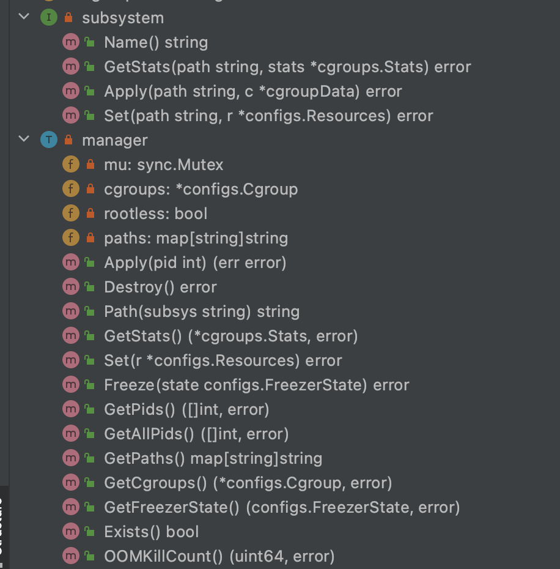
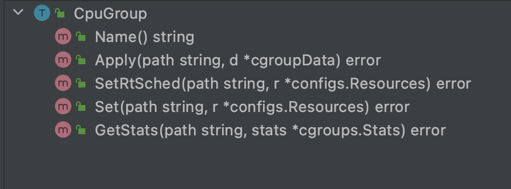
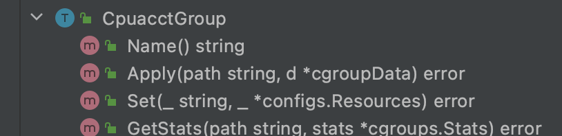
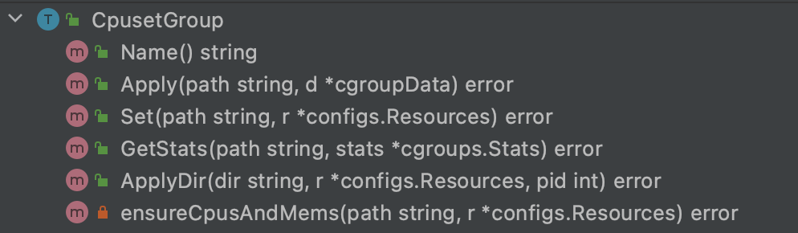
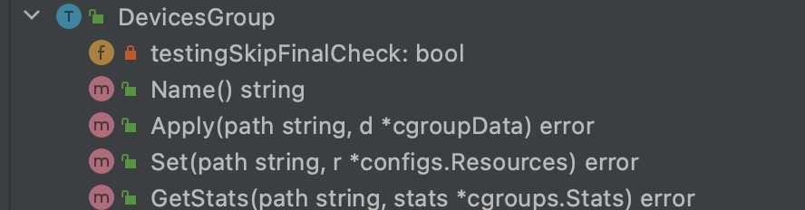
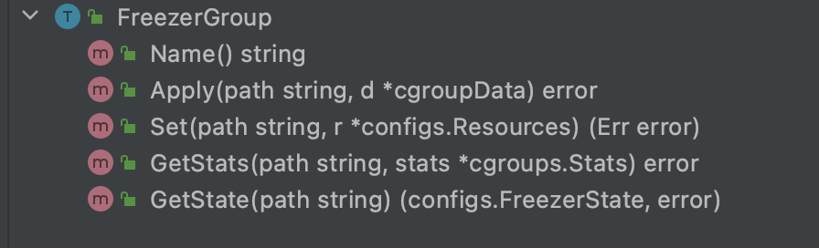
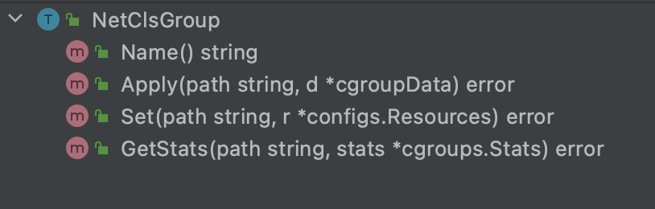
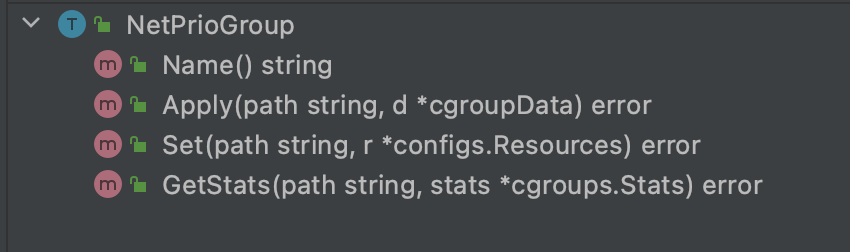
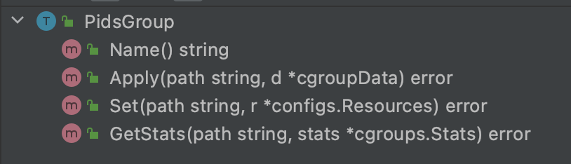
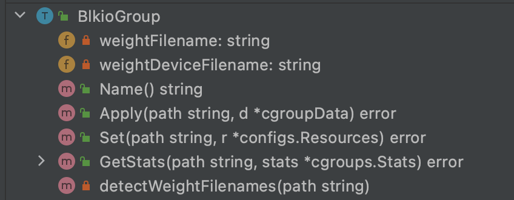

# CGroups学习


`CGroups`是Linux内核的一个重要组件之一，用来限制单个进程或者进程组所使用的资源，如CPU、内存、设备等。当前流行的容器技术Docker，其底层也是依赖`CGroups`来对容器使用的资源进行限制。

我们也可以在操作系统中，使用`CGroups`来控制系统中运行的进程，对它们使用的资源进行限制，后续使用方法里会介绍。

## 概念

### CGroups子系统

`CGroups`全称是`Control Groups(控制组)`，它对系统中的资源进行分类，每种被控制的资源分为一个子系统，下面是各种资源对应的子系统：

- `cpu`子系统：用来限制组中进程的CPU使用率；
- `cpuacct`子系统：用来统计组中进程的CPU使用报告；
- `cpuset`子系统：用来给组中的进程分配单独的CPU节点；
- `memory`子系统：用来限制组中进程的memory使用量；
- `blkio`子系统：用来限制组中进程的块设备IO；
- `devices`子系统：用来控制组中进程可以访问的设备；
- `net_cls`子系统：用来标记组中进程的网络数据包，然后使用tc(traffic control) 模块对数据包进行控制；
- `freezer`子系统：用来挂起或者恢复组中的进程；
- `ns`子系统：用来给不同的`CGroups`组中进程使用不同的`namespace`；

`CGroups`的每一个子系统，内核中都有一个对应的模块，来实现对应的限制功能。

那操作系统内核是如何把`CGroups`各个子系统的配置和进程进行关联的呢？这里就要解释`CGroups`的层级结构了。下面来看看`CGroups`层级结构是个什么东西。

### CGroups层级结构

内核中使用`cgroup`结构体来表示一个cgroup对一个或某几个cgroups子系统的资源限制。`cgroup`结构体一般组成成一颗树的形式，这颗树即为一个`CGroups`层级结构，系统中一般存在多个这样的树。

`CGroups`层级结构可以attach一个或者多个`CGroups`子系统，来实现对多个子系统相关的资源进行限制。但每一个`CGroups`子系统只能与一个`CGroups`层级结构关联。


如上图：`cpu`和`cpuacct`与 A 层级结构关联，`memory`子系统与 B 层级结构关联。层级结构中每一个节点都是`cgroup`结构体(如cpu_cgrp/cgrp1/cgrp2/memory_cgrp/cgrp3/cgrp4)。上图中，A 层级结构实现的是CPU的资源限制，其中 cgrp1 下的进程只能最多使用60%的CPU，cgrp2 下的进程最多只能使用20% 的CPU；B 层级结构实现了对内存使用量的限制。

`CGroups`层级结构是内核中将配置与进程用来关联的中间结构，下面我们来看看如何与进程关联。

### CGroups与进程进行关联

上面我们创建了`CGroups`的层级结构，且提到每一个节点都是一个`cgroup`结构体，其中`cgroup`节点中有一个控制任务列表，控制列表里就存储了进程信息。

当我们把进程加入到层级结构中的某个节点时，节点中的所有进程就都会收到当前节点的资源限制。进程与节点的对应关系如下：

- 一个进程只能加入同一层级结构的其中一个节点；因为一个进程的同一个资源不能有两份配置；
- 一个进程可以加入多个层级结构，实现对不同资源的限制；
- 层级结构的一个节点，可以加入多个进程；


上面这张图从整体结构上描述了进程与`CGroups`之间的关系，上面部分就是`CGroups`层级结构，跟前面那张图一样。下半部分中，**P** 是代表一个进程，每个进程的描述符中，有一个指针指向了一个辅助数据结构: `css_set(cgroups subsystem set)`。指向某一个`css_set`进程，也被加入到了该`css_set`的进程列表中，一个进程只能属于一个`css_set`，一个`css_set`可以包含多个进程。属于同一个`css_set`的进程都受到同一个`css_set`的资源限制。

中间的 `MxN Linkage`是另一个辅助结构，用来将`css_set`与`CGroups`层级结构的多个节点进行多对多的关联。

前面说`CGroups`层级结构其实是内核里的架构，那在用户态中，我们如何配置呢？用户态的配置又是通过什么技术实现到内核层级结构的映射的呢？下面我们就来看看`CGroups`文件系统。

## CGroups文件系统

前面讲的都是内核的实现架构，那用户态是什么样子的呢？用户态的进程又是如何来使用到cgroups的功能呢？

现在要引入Linux内核中一个强大的模块`VFS(Vitual File System)`。VFS能够把具体的文件系统的实现细节隐藏起来，给用户态进程提供一个统一的文件系统API接口。cgroups 也是通过 VFS 把功能暴露给用户态的，cgroups与 VFS 之间的衔接部分叫做 cgroups文件系统。

### VFS

VFS 是一个内核抽象层，能够隐藏具体文件系统的实现细节，从而给用户态进程提供一套统一的 API 接口。

VFS 使用了一种通用文件系统的设计，具体的文件系统只要实现了 VFS 的设计接口，就能够注册到 VFS 中，从而使内核可以读写这种文件系统。 

这跟面向对象设计中的接口与实现类似，接口负责暴露服务，实现用来实现具体的功能。其实，VFS本身就是用 c 语言实现的一套面向对象的接口。

#### 通用文件模型

VFS 通用文件模型中包含以下四种元数据结构：

- 超级块对象(superblock object)，用于存放已经注册的文件系统的信息。比如ext2，ext3等这些基础的磁盘文件系统；还有用于读写socket的socket文件系统；以及当前的用于读写cgroups配置信息的 cgroups 文件系统等。
- 索引节点对象(inode object)，用于存放具体文件的信息（这里面比较重要的一个部分是一个叫做 inode_operations 的结构体，这个结构体定义了在具体文件系统中创建文件，删除文件等的具体实现。）
  - 对于一般的磁盘文件系统而言，inode 节点中一般会存放文件在硬盘中的存储块等信息；
  - 对于socket文件系统，inode会存放socket的相关属性；
  - 对于cgroups这样的特殊文件系统，inode会存放与 cgroup 节点相关的属性信息；
- 文件对象(file object)，一个文件对象表示进程内打开的一个文件，文件对象是存放在进程的文件描述符表里面的（同样这个文件中比较重要的部分是一个叫 file_operations 的结构体，这个结构体描述了具体的文件系统的读写实现。当进程在某一个文件描述符上调用读写操作时，实际调用的是 file_operations 中定义的方法）
  -  对于普通的磁盘文件系统，file_operations 中定义的就是普通的块设备读写操作；
  - 对于socket文件系统，file_operations 中定义的就是 socket 对应的 send/recv 等操作；
  - 对于cgroups这样的特殊文件系统，file_operations 中定义的就是操作 cgroup 结构体等具体的实现。
- 目录项对象(dentry object)，在每个文件系统中，内核在查找某一个路径中的文件时，会为内核路径上的每一个分量都生成一个目录项对象，通过目录项对象能够找到对应的 inode 对象，目录项对象一般会被缓存，从而提高内核查找速度。

### CGroups文件系统的实现

基于 VFS 实现的文件系统,都必须实现 VFS 通用文件模型定义的这些对象，并实现这些对象中定义的部分函数。cgroup 文件系统也不例外,下面来看一下 cgroups 中这些对象的定义。

#### file_system_type: 文件系统结构体

```c
static struct file_system_type cgroup_fs_type = {
        .name = "cgroup",
        .mount = cgroup_mount,
        .kill_sb = cgroup_kill_sb,
};
```

- `cgroup_mount`: 装载cgroups文件系统；
- `cgroup_kill_sb`：卸载cgroups文件系统；

#### super_operations: 超级块对象

```c
static const struct super_operations cgroup_ops = {
        .statfs = simple_statfs,
        .drop_inode = generic_delete_inode,
        .show_options = cgroup_show_options,
        .remount_fs = cgroup_remount,
};
```

- `simple_statfs`: 获取文件系统状态；
- `generic_delete_inode`: 删除inode，不实现；
- `cgroup_show_options`: 获取支持的选项；
- `cgroup_remount`： 重挂载；

#### inode_operations & file_operations: inode和file 操作实现

```c
static const struct inode_operations cgroup_dir_inode_operations = {
        .lookup = cgroup_lookup, // 查找
        .mkdir = cgroup_mkdir, // 创建目录
        .rmdir = cgroup_rmdir, // 删除目录
        .rename = cgroup_rename, // 重命名
};

static const struct file_operations cgroup_file_operations = {
        .read = cgroup_file_read, // 读取文件
        .write = cgroup_file_write, // 写文件
        .llseek = generic_file_llseek, // seek，不实现
        .open = cgroup_file_open, // 打开文件
        .release = cgroup_file_release, // 释放文件
};
```

通过使用VFS的借口，我们就可以编辑cgroups配置文件，或者在进程中对配置文件进行读写操作。

内核会根据这些配置文件，映射为对应的cgroups层级结构，从而实现资源限制功能。

## 使用方法

### 挂载

挂载文件系统，Linux上有mount命令，那么挂载cgroups文件系统：

```sh
mount -t cgroup -o subsystems name /cgroup/name
```

- subsystem: 要挂载的cgroups子系统；
- /cgroup/name： 挂载点；

在centos下面，在使用`yum install libcgroup`安装了cgroups模块之后，在 /etc/cgconfig.conf 文件中会自动生成 cgroups 子系统的挂载点:

```shell
mount {
    cpuset  = /cgroup/cpuset;
    cpu = /cgroup/cpu;
    cpuacct = /cgroup/cpuacct;
    memory  = /cgroup/memory;
    devices = /cgroup/devices;
    freezer = /cgroup/freezer;
    net_cls = /cgroup/net_cls;
    blkio   = /cgroup/blkio;
}
```

上面的每一条配置都等价于展开的 mount 命令，例如`mount -t cgroup -o cpuset cpuset /cgroup/cpuset`。这样系统启动之后会自动把这些子系统挂载到相应的挂载点上。

### 子节点与进程

挂载某一个 cgroups 子系统到挂载点之后，就可以通过在挂载点下面建立文件夹或者使用cgcreate命令的方法创建 cgroups 层级结构中的节点。

比如通过命令`cgcreate -t sankuai:sankuai -g cpu:test`就可以在 cpu 子系统下建立一个名为 test 的节点。结果如下所示：

```shell
[root@idx cpu]# ls
cgroup.event_control  cgroup.procs  cpu.cfs_period_us  cpu.cfs_quota_us  cpu.rt_period_us   cpu.rt_runtime_us  cpu.shares  cpu.stat  lxc  notify_on_release  release_agent  tasks  test
```

然后可以通过写入需要的值到 test 下面的不同文件，来配置需要限制的资源。

每个子系统下面都可以进行多种不同的配置，需要配置的参数各不相同，详细的参数设置需要参考 cgroups 手册。

使用 cgset 命令也可以设置 cgroups 子系统的参数，格式为 `cgset -r parameter=value path_to_cgroup`。

当需要删除某一个 cgroups 节点的时候，可以使用 cgdelete 命令，比如要删除上述的 test 节点，可以使用 `cgdelete -r cpu:test`命令进行删除

把进程加入到 cgroups 子节点也有多种方法，可以直接把 pid 写入到子节点下面的 task 文件中。

也可以通过 cgclassify 添加进程，格式为 `cgclassify -g subsystems:path_to_cgroup pidlist`，也可以直接使用 cgexec 在某一个 cgroups 下启动进程，格式为`gexec -g subsystems:path_to_cgroup command arguments`.

## 实践

### Docker

Docker 在实现不同的 Container 之间资源隔离和控制的时候，是可以创建比较复杂的 cgroups 节点和配置文件来完成的。然后对于同一个 Container 中的进程，可以把这些进程 PID 添加到同一组 cgroups 子节点中已达到对这些进程进行同样的资源限制。

### 源码学习

当前版本的docker中，`cgroups`相关的代码在 [opencontainers/runc](https://github.com/opencontainers/runc)中。

#### Manager接口

libcontainer/cgroups/cgroups.go Manager接口定义了操作`CGroups`的方法：

```go
type Manager interface {
	// 如果还没有CGroup，会创建一个，并将pid加入该组；若pid=-1则只创建CGroup组
	Apply(pid int) error

	// 获取CGroup节点中所有的PID列表
	GetPids() ([]int, error)

  // 获取CGroup节点及其子节点的所有PID
	GetAllPids() ([]int, error)

	// 获取CGroup的统计信息
	GetStats() (*Stats, error)

  // 按参数挂起或恢复CGroup
	Freeze(state configs.FreezerState) error

	// 销毁CGroup
	Destroy() error

  // 返回子系统的路径
	Path(string) string

	// 设置资源限制
	Set(r *configs.Resources) error

	// 获取整个层级结构的路径
	GetPaths() map[string]string

	// 获取CGroup的信息
	GetCgroups() (*configs.Cgroup, error)

	// 获取当前CGroup的状态
	GetFreezerState() (configs.FreezerState, error)

	// 判断路径是否已存在
	Exists() bool

	// OOM kill次数
	OOMKillCount() (uint64, error)
}
```

#### 子模块

- `devices`
- `ebpf`
- `fs`
- `fs2`
- `fscommon`
- `systemd`

我们主要看`fs`模块中的内容。

##### Manager实现和subsystem



##### CpuGroup



##### CpuacctGroup



##### CpusetGroup



##### DevicesGroup



FreezerGroup



##### NetClsGroup



##### NetPrioGroup



##### PidsGroup



##### BlkioGroup



## 参考文档

1. https://tech.meituan.com/2015/03/31/cgroups.html

