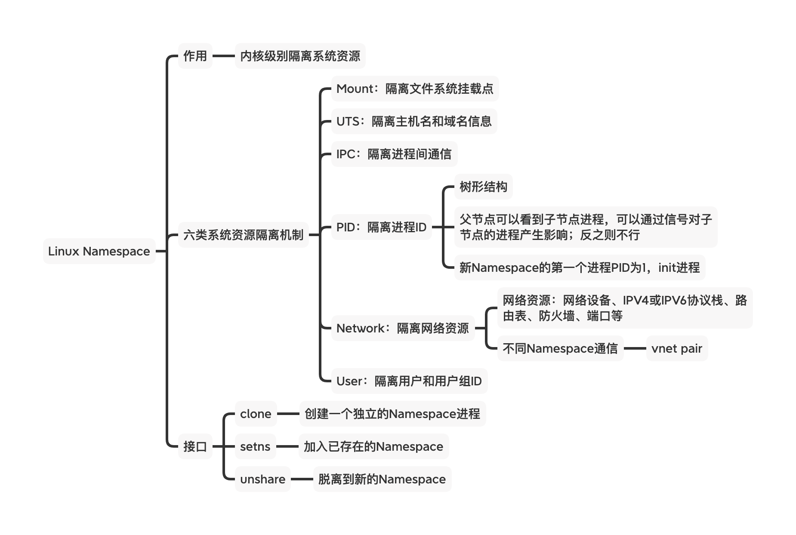

# Namespace学习



## 作用

`Linux Namespace` 是**内核级别隔离系统资源的方法**，通过将系统中的各种资源放在不同的 `Namespace` 中，来实现资源隔离的目的。不同 `Namespace` 之间的进程，各自有一份独立的系统资源；相同 `Namespace`里的进程，共享同一份系统资源。

## 分类

目前Linux中，提供了以下六种系统资源的隔离机制：

| Namespace | 隔离内容                   | 内核版本 | Flag            | 目录                  |
| --------- | -------------------------- | -------- | --------------- | --------------------- |
| Mount     | 挂载点（文件xit）          | 2.4.19   | CLONE_NEWNS     | /proc/[pid]/ns/mnt    |
| UTS       | 主机名和域名               | 2.6.19   | CLONE_NEWUTS    | /proc/[pid]/ns/uts    |
| IPC       | 信号量、消息队列和共享内存 | 2.6.19   | CLONE_NEWIPC    | /proc/[pid]/ns/ipc    |
| PID       | 进程                       | 2.6.24   | CLONE_NEWPID    | /proc/[pid]/ns/pid    |
| Network   | 网络设备、网络栈、端口等   | 2.5.29   | CLONE_NEWNET    | /proc/[pid]/ns/net    |
| User      | 用户和用户组               | 3.8      | CLONE_NEWUSER   | /proc/[pid]/ns/user   |
| Cgroup    | Cgroup根目录               | 4.6      | CLONE_NEWCGROUP | /proc/[pid]/ns/cgroup |

## 系统接口

| 接口    | 作用                                               | 接口                                                         |      |
| ------- | -------------------------------------------------- | ------------------------------------------------------------ | ---- |
| clone   | 创建一个隔离的进程，可通过前面的FLAG控制拥有的资源 | int clone(int (*fn)(void *), void *stack, int flags, void *arg); |      |
| setns   | 允许一个进程加入到现有的namespace                  | int setns(int fd, int nstype);                               |      |
| unshare | 从现有的namespace中移除一个进程                    | int unshare(int flags);                                      |      |
| ioctl   | 用于发现namespace信息                              | int ioctl(int fd, unsigned long request, ...);               |      |

## Go实现

### UTS隔离

```go
package main

import (
	"os"
	"os/exec"
	"syscall"
	"github.com/sirupsen/logrus"
)

func main() {
	if len(os.Args) < 3 {
		logrus.Errorf("missing commands")
		return
	}

	switch os.Args[1] {
	case "run":
		run(os.Args[2])
	default:
		logrus.Errorf("wrong command")
		return
	}
}

func run(command string) {
	logrus.Infof("running %v", os.Args[2:])

	cmd := exec.Command(command)

	cmd.SysProcAttr = &syscall.SysProcAttr{
		Cloneflags: syscall.CLONE_NEWUTS,
	}

	cmd.Stdin = os.Stdin
	cmd.Stdout = os.Stdout
	cmd.Stderr = os.Stderr


	check(cmd.Run())
}

func check(err error) {
	if err != nil {
		logrus.Errorln(err)
	}
}
```

运行查看，可以发现在新进程中，修改hostname对宿主机无影响：

```sh
go run main.go run sh
INFO[0000] running [sh]
hostname
ubuntu001
hostname test001
hostname
test001
# 宿主机
root@ubuntu001:~# hostname
ubuntu001
```

### USER隔离

在前面代码中，修改`run`函数如下：

```go
func run(command string) {
	logrus.Infof("running %v", os.Args[2:])

	cmd := exec.Command(command)

	cmd.SysProcAttr = &syscall.SysProcAttr{
		Cloneflags: syscall.CLONE_NEWUTS | syscall.CLONE_NEWUSER,
		UidMappings: []syscall.SysProcIDMap{
			{
				ContainerID: 1,
				HostID: 0,
				Size: 1,
			},
		},
		GidMappings: []syscall.SysProcIDMap{
			{
				ContainerID: 1,
				HostID: 0,
				Size: 1,
			},
		},
	}

	cmd.Stdin = os.Stdin
	cmd.Stdout = os.Stdout
	cmd.Stderr = os.Stderr


	check(cmd.Run())
}
```

运行查看结果，通过`CLONE_NEWUSER`可实现用户空间隔离：

```sh
root@ubuntu001:~/go/namespace# go run main.go run sh
INFO[0000] running [sh]
$ id
uid=1(daemon) gid=1(daemon) groups=1(daemon)
# 宿主机中
root@ubuntu001:~# id
uid=0(root) gid=0(root) groups=0(root)
```

### PID隔离

在UTS代码中，添加标记位`CLONE_NEWPID`, `run`函数如下所示：

```go
func run(command string) {
	logrus.Infof("running %v", os.Args[2:])

	cmd := exec.Command(command)

	cmd.SysProcAttr = &syscall.SysProcAttr{
		Cloneflags: syscall.CLONE_NEWUTS | syscall.CLONE_NEWPID,
	}

	cmd.Stdin = os.Stdin
	cmd.Stdout = os.Stdout
	cmd.Stderr = os.Stderr


	check(cmd.Run())
}
```

运行查看结果，可知新进程中当前程序的进程ID为1:

```sh
root@ubuntu001:~/go/namespace# go run main.go run sh
INFO[0000] running [sh]
# echo $$
1
# 宿主机
root@ubuntu001:~# echo $$
7178
```

### NET网络隔离

通过添加标记为`CLONE_NEWNET`，可以实现网络隔离

```
func run(command string) {
	logrus.Infof("running %v", os.Args[2:])

	cmd := exec.Command(command)

	cmd.SysProcAttr = &syscall.SysProcAttr{
		Cloneflags: syscall.CLONE_NEWUTS | syscall.CLONE_NEWPID | syscall.CLONE_NEWNET,
	}

	cmd.Stdin = os.Stdin
	cmd.Stdout = os.Stdout
	cmd.Stderr = os.Stderr


	check(cmd.Run())
}
```

运行查看效果，新进程中还没有虚拟网络设备，且跟宿主机的不一样：

```sh
root@ubuntu001:~/go/namespace# go run main.go run sh
INFO[0000] running [sh]
# ifconfig
# 宿主机
root@ubuntu001:~# ifconfig
cni0: flags=4163<UP,BROADCAST,RUNNING,MULTICAST>  mtu 1450
        inet 10.0.0.1  netmask 255.255.255.0  broadcast 10.0.0.255
        inet6 fe80::2ca4:44ff:fe44:769c  prefixlen 64  scopeid 0x20<link>
        ether 2e:a4:44:44:76:9c  txqueuelen 1000  (Ethernet)
        RX packets 25856  bytes 1584460 (1.5 MB)
        RX errors 0  dropped 0  overruns 0  frame 0
        TX packets 12261  bytes 1163642 (1.1 MB)
        TX errors 0  dropped 0 overruns 0  carrier 0  collisions 0

docker0: flags=4163<UP,BROADCAST,RUNNING,MULTICAST>  mtu 1500
        inet 172.17.0.1  netmask 255.255.0.0  broadcast 172.17.255.255
        inet6 fe80::42:6cff:fea1:cb9a  prefixlen 64  scopeid 0x20<link>
        ether 02:42:6c:a1:cb:9a  txqueuelen 0  (Ethernet)
        RX packets 0  bytes 0 (0.0 B)
        RX errors 0  dropped 0  overruns 0  frame 0
        TX packets 5  bytes 526 (526.0 B)
        TX errors 0  dropped 0 overruns 0  carrier 0  collisions 0
...
```

### IPC隔离

在`run` 函数中，添加 `CLONE_NEWIPC` 标记，修改后的`run`函数如下：

```go
func run(command string) {
	logrus.Infof("running %v", os.Args[2:])

	cmd := exec.Command(command)

	cmd.SysProcAttr = &syscall.SysProcAttr{
		Cloneflags: syscall.CLONE_NEWUTS | syscall.CLONE_NEWPID | syscall.CLONE_NEWNET | syscall.CLONE_NEWIPC,
	}

	cmd.Stdin = os.Stdin
	cmd.Stdout = os.Stdout
	cmd.Stderr = os.Stderr


	check(cmd.Run())
}
```

运行后，可以看到，宿主机前后的IPC队列并没有变化，而新进程中通过`ipcmk -Q`后，多了一个消息队列：

```sh
# 宿主机
root@ubuntu001:~# ipcs

------ Message Queues --------
key        msqid      owner      perms      used-bytes   messages

------ Shared Memory Segments --------
key        shmid      owner      perms      bytes      nattch     status

------ Semaphore Arrays --------
key        semid      owner      perms      nsems
# 新进程
# ipcs

------ Message Queues --------
key        msqid      owner      perms      used-bytes   messages

------ Shared Memory Segments --------
key        shmid      owner      perms      bytes      nattch     status

------ Semaphore Arrays --------
key        semid      owner      perms      nsems
# ipcmk -Q
Message: not found0
# ipcs

------ Message Queues --------
key        msqid      owner      perms      used-bytes   messages
0xd2079538 0          root       644        0            0

------ Shared Memory Segments --------
key        shmid      owner      perms      bytes      nattch     status

------ Semaphore Arrays --------
key        semid      owner      perms      nsems
# 宿主机
root@ubuntu001:~# ipcs

------ Message Queues --------
key        msqid      owner      perms      used-bytes   messages

------ Shared Memory Segments --------
key        shmid      owner      perms      bytes      nattch     status

------ Semaphore Arrays --------
key        semid      owner      perms      nsems
```

### Mount 隔离

下面修改后的`run`函数，添加了`CLONE_NEWNS`标记；

```go
func run(command string) {
	logrus.Infof("running %v", os.Args[2:])

	cmd := exec.Command(command)
	
	cmd.SysProcAttr = &syscall.SysProcAttr{
		Cloneflags: syscall.CLONE_NEWUTS | syscall.CLONE_NEWUSER | syscall.CLONE_NEWPID | syscall.CLONE_NEWNET | syscall.CLONE_NEWIPC | syscall.CLONE_NEWNS,
		UidMappings: []syscall.SysProcIDMap{
			{
				ContainerID: 0,
				HostID: 0,
				Size: 1,
			},
		},
		GidMappings: []syscall.SysProcIDMap{
			{
				ContainerID: 0,
				HostID: 0,
				Size: 1,
			},
		},
	}

	cmd.Stdin = os.Stdin
	cmd.Stdout = os.Stdout
	cmd.Stderr = os.Stderr

	check(cmd.Run())
}
```

运行查看结果

```sh
root@ubuntu001:~/go/namespace# go run main.go run sh
INFO[0000] running [sh]
# mount -t proc proc /proc  // 将proc重新挂载，不使用默认的系统挂载
# ps -ef
UID          PID    PPID  C STIME TTY          TIME CMD
root           1       0  0 07:14 pts/4    00:00:00 sh
root           4       1  0 07:14 pts/4    00:00:00 ps -ef
# 宿主机 并不影响
root@ubuntu001:~# ps -ef
UID          PID    PPID  C STIME TTY          TIME CMD
root           1       0  0 03:27 ?        00:00:05 /sbin/init maybe-ubiquity
root           2       0  0 03:27 ?        00:00:00 [kthreadd]
root           3       2  0 03:27 ?        00:00:00 [rcu_gp]
root           4       2  0 03:27 ?        00:00:00 [rcu_par_gp]
root           6       2  0 03:27 ?        00:00:00 [kworker/0:0H-kblockd]
root           9       2  0 03:27 ?        00:00:00 [mm_percpu_wq]
root          10       2  0 03:27 ?        00:00:00 [ksoftirqd/0]
...
```


## Docker源码

`Docker`中 `Namespace`相关的源码使用C语言实现，go通过CGO调用，源码所在位置：runc/libcontainer/nsenter ;

## 参考文档

1. https://man7.org/linux/man-pages/man7/namespaces.7.html
2. https://github.com/opencontainers/runc/tree/master/libcontainer/nsenter
