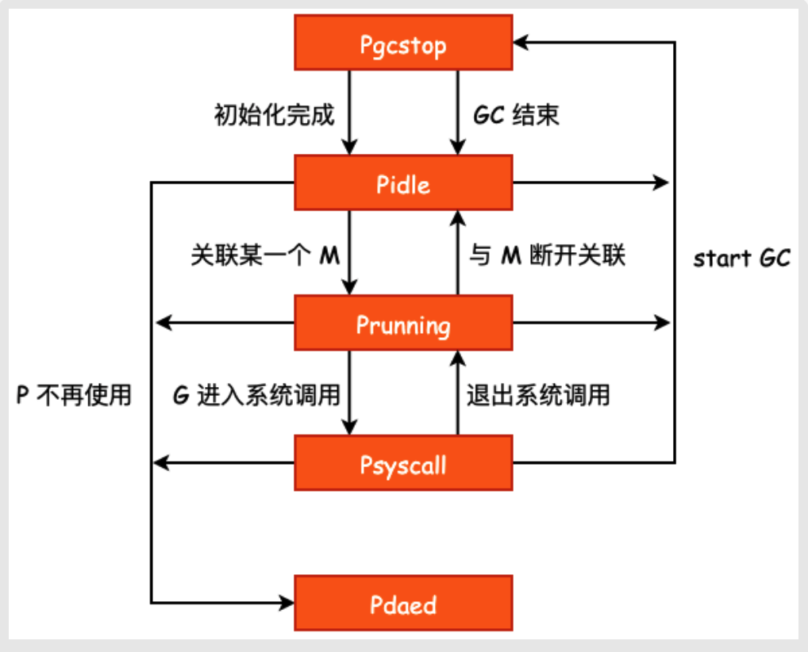
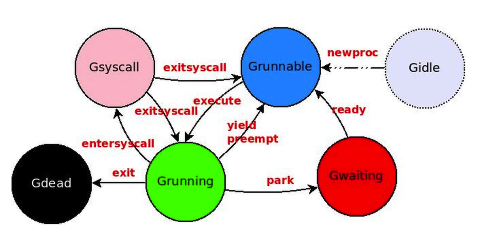

# Go GMP 学习

## 概念

学习GMP需要了解操作系统进程和线程的概念，和Go中特有的协程调度相关的概念。

- `进程`:  程序的一次执行过程，是操作系统在执行程序过程中的分配和管理资源的基本单位。每个进程都有自己的地址空间和至少一个线程。进程间通信依赖于IPC，同步简单。各个进程间资源是隔离的，所以一般互不影响。
- `线程`: 线程是CPU调度和分配的基本单位，它可与同一进程下的其它线程共享全部资源。线程具有自己的运行栈和程序计数器。线程是任务调度执行的基本单位，也是并发的基础。
- `协程`:  用户态的轻量级线程，协程调度完全由用户控制。协程也拥有自己的栈和寄存器上下文。协程切换时，将寄存器上下文和栈保存到堆中；在切换回来时恢复保存的寄存器上下文和栈。这些操作没有内核切换的开销，也不需要加锁，所以切换比线程快。
- `M`: 代表一个内核线程，也叫工作线程。
- `P`: P是M和G的纽带，保存了G执行所必需的上下文资源。
- `G`: 代表一个由go关键字创建的并发代码片段；
- `KSE`: 内核调度实体，就是可以被内核的调度器调度的对象。是操作系统内核调度的最小调度但愿但愿单元。

GMP与KSE的关系可看下图：


## M

`M` 代表一个工作线程，也即是系统现场。`G` 只有调度到 `M` 上才能运行，`M` 是Go中真正运行代码的实现。

`M` 主要保存了自身使用的栈信息、当前正在 `M` 上运行的G的信息、与之绑定的 `P` 信息等。

当 `M` 没有工作可做时，在它休眠前，会"自旋" 的去找事情做，包括查找全局队列、network poller等，或者执行 "GC"任务和去其它 `M` 偷工作。

### 结构体

```go
type m struct {
	g0      *g     // goroutine with scheduling stack
	morebuf gobuf  // gobuf arg to morestack
	divmod  uint32 // div/mod denominator for arm - known to liblink

	// Fields not known to debuggers.
	procid        uint64            // for debuggers, but offset not hard-coded
	gsignal       *g                // signal-handling g
	goSigStack    gsignalStack      // Go-allocated signal handling stack
	sigmask       sigset            // storage for saved signal mask
	tls           [tlsSlots]uintptr // thread-local storage (for x86 extern register)
	mstartfn      func()
	curg          *g       // current running goroutine
	caughtsig     guintptr // goroutine running during fatal signal
	p             puintptr // attached p for executing go code (nil if not executing go code)
	nextp         puintptr
	oldp          puintptr // the p that was attached before executing a syscall
	id            int64
	mallocing     int32
	throwing      int32
	preemptoff    string // if != "", keep curg running on this m
	locks         int32
	dying         int32
	profilehz     int32
	spinning      bool // m is out of work and is actively looking for work
	blocked       bool // m is blocked on a note
	newSigstack   bool // minit on C thread called sigaltstack
	printlock     int8
	incgo         bool   // m is executing a cgo call
	freeWait      uint32 // if == 0, safe to free g0 and delete m (atomic)
	fastrand      [2]uint32
	needextram    bool
	traceback     uint8
	ncgocall      uint64      // number of cgo calls in total
	ncgo          int32       // number of cgo calls currently in progress
	cgoCallersUse uint32      // if non-zero, cgoCallers in use temporarily
	cgoCallers    *cgoCallers // cgo traceback if crashing in cgo call
	doesPark      bool        // non-P running threads: sysmon and newmHandoff never use .park
	park          note
	alllink       *m // on allm
	schedlink     muintptr
	lockedg       guintptr
	createstack   [32]uintptr // stack that created this thread.
	lockedExt     uint32      // tracking for external LockOSThread
	lockedInt     uint32      // tracking for internal lockOSThread
	nextwaitm     muintptr    // next m waiting for lock
	waitunlockf   func(*g, unsafe.Pointer) bool
	waitlock      unsafe.Pointer
	waittraceev   byte
	waittraceskip int
	startingtrace bool
	syscalltick   uint32
	freelink      *m // on sched.freem

	// mFixup is used to synchronize OS related m state
	// (credentials etc) use mutex to access. To avoid deadlocks
	// an atomic.Load() of used being zero in mDoFixupFn()
	// guarantees fn is nil.
	mFixup struct {
		lock mutex
		used uint32
		fn   func(bool) bool
	}

	// these are here because they are too large to be on the stack
	// of low-level NOSPLIT functions.
	libcall   libcall
	libcallpc uintptr // for cpu profiler
	libcallsp uintptr
	libcallg  guintptr
	syscall   libcall // stores syscall parameters on windows

	vdsoSP uintptr // SP for traceback while in VDSO call (0 if not in call)
	vdsoPC uintptr // PC for traceback while in VDSO call

	// preemptGen counts the number of completed preemption
	// signals. This is used to detect when a preemption is
	// requested, but fails. Accessed atomically.
	preemptGen uint32

	// Whether this is a pending preemption signal on this M.
	// Accessed atomically.
	signalPending uint32

	dlogPerM

	mOS

	// Up to 10 locks held by this m, maintained by the lock ranking code.
	locksHeldLen int
	locksHeld    [10]heldLockInfo
}
```

主要字段

- `g0`:  OS在启动时，为M分配的特殊的G；
- `gsignal`: 处理signal的G；
- `mstartfn`: m的启动函数，一般为nil或sysmon；
- `curg`: 当前运行的G 的指针；
- `p`: 当前与 M 绑定的 P；
- `nextp`: 临时存放的有关系的 P；
- `oldp`: syscall之前的绑定的 P，syscall之后 P 与 M 解绑去寻找空闲的 M；
- `preemptoff`: 当前M是否关闭抢占式调度；
- `spinning`: 自旋状态，表示当前 M 是否在寻找可运行的G；
- `lockdg`: 与 M 强绑定的 G，该 G 不可以在其它 M 中运行；
- `park`: 休眠锁；
- `thread`: 操作系统线程ID；

### 创建


## P

`P` 的作用主要为 `M` 提供 "上下文"，主要保存 `M` 运行 `G` 时需要的资源。如本地可运行 `G` 队列、缓存等。

`M` 只有绑定了 `M` 才能执行 goroutine，当 `M` 被阻塞时，绑定的`P`会与它解绑，并寻找其它空闲的`M`进行绑定。

### 结构体

```go
type p struct {
	id          int32
	status      uint32 // one of pidle/prunning/...
	link        puintptr
	schedtick   uint32     // incremented on every scheduler call
	syscalltick uint32     // incremented on every system call
	sysmontick  sysmontick // last tick observed by sysmon
	m           muintptr   // back-link to associated m (nil if idle)
	mcache      *mcache
	pcache      pageCache
	raceprocctx uintptr

	deferpool    [5][]*_defer // pool of available defer structs of different sizes (see panic.go)
	deferpoolbuf [5][32]*_defer

	// Cache of goroutine ids, amortizes accesses to runtime·sched.goidgen.
	goidcache    uint64
	goidcacheend uint64

	// Queue of runnable goroutines. Accessed without lock.
	runqhead uint32
	runqtail uint32
	runq     [256]guintptr
	// runnext, if non-nil, is a runnable G that was ready'd by
	// the current G and should be run next instead of what's in
	// runq if there's time remaining in the running G's time
	// slice. It will inherit the time left in the current time
	// slice. If a set of goroutines is locked in a
	// communicate-and-wait pattern, this schedules that set as a
	// unit and eliminates the (potentially large) scheduling
	// latency that otherwise arises from adding the ready'd
	// goroutines to the end of the run queue.
	//
	// Note that while other P's may atomically CAS this to zero,
	// only the owner P can CAS it to a valid G.
	runnext guintptr

	// Available G's (status == Gdead)
	gFree struct {
		gList
		n int32
	}

	sudogcache []*sudog
	sudogbuf   [128]*sudog

	// Cache of mspan objects from the heap.
	mspancache struct {
		// We need an explicit length here because this field is used
		// in allocation codepaths where write barriers are not allowed,
		// and eliminating the write barrier/keeping it eliminated from
		// slice updates is tricky, moreso than just managing the length
		// ourselves.
		len int
		buf [128]*mspan
	}

	tracebuf traceBufPtr

	// traceSweep indicates the sweep events should be traced.
	// This is used to defer the sweep start event until a span
	// has actually been swept.
	traceSweep bool
	// traceSwept and traceReclaimed track the number of bytes
	// swept and reclaimed by sweeping in the current sweep loop.
	traceSwept, traceReclaimed uintptr

	palloc persistentAlloc // per-P to avoid mutex

	_ uint32 // Alignment for atomic fields below

	// The when field of the first entry on the timer heap.
	// This is updated using atomic functions.
	// This is 0 if the timer heap is empty.
	timer0When uint64

	// The earliest known nextwhen field of a timer with
	// timerModifiedEarlier status. Because the timer may have been
	// modified again, there need not be any timer with this value.
	// This is updated using atomic functions.
	// This is 0 if the value is unknown.
	timerModifiedEarliest uint64

	// Per-P GC state
	gcAssistTime         int64 // Nanoseconds in assistAlloc
	gcFractionalMarkTime int64 // Nanoseconds in fractional mark worker (atomic)

	// gcMarkWorkerMode is the mode for the next mark worker to run in.
	// That is, this is used to communicate with the worker goroutine
	// selected for immediate execution by
	// gcController.findRunnableGCWorker. When scheduling other goroutines,
	// this field must be set to gcMarkWorkerNotWorker.
	gcMarkWorkerMode gcMarkWorkerMode
	// gcMarkWorkerStartTime is the nanotime() at which the most recent
	// mark worker started.
	gcMarkWorkerStartTime int64

	// gcw is this P's GC work buffer cache. The work buffer is
	// filled by write barriers, drained by mutator assists, and
	// disposed on certain GC state transitions.
	gcw gcWork

	// wbBuf is this P's GC write barrier buffer.
	//
	// TODO: Consider caching this in the running G.
	wbBuf wbBuf

	runSafePointFn uint32 // if 1, run sched.safePointFn at next safe point

	// statsSeq is a counter indicating whether this P is currently
	// writing any stats. Its value is even when not, odd when it is.
	statsSeq uint32

	// Lock for timers. We normally access the timers while running
	// on this P, but the scheduler can also do it from a different P.
	timersLock mutex

	// Actions to take at some time. This is used to implement the
	// standard library's time package.
	// Must hold timersLock to access.
	timers []*timer

	// Number of timers in P's heap.
	// Modified using atomic instructions.
	numTimers uint32

	// Number of timerModifiedEarlier timers on P's heap.
	// This should only be modified while holding timersLock,
	// or while the timer status is in a transient state
	// such as timerModifying.
	adjustTimers uint32

	// Number of timerDeleted timers in P's heap.
	// Modified using atomic instructions.
	deletedTimers uint32

	// Race context used while executing timer functions.
	timerRaceCtx uintptr

	// preempt is set to indicate that this P should be enter the
	// scheduler ASAP (regardless of what G is running on it).
	preempt bool

	// Padding is no longer needed. False sharing is now not a worry because p is large enough
	// that its size class is an integer multiple of the cache line size (for any of our architectures).
}
```

重要字段：

- `status`: P的状态；

- `schedtick`：调用schedule的次数；

- `syscalltick`: 系统调用的次数；

- `sysmontick`: sysmon线程被调用的次数；

- `m`: 绑定的`M` ，当`P` 是idle是，该值为nil；

- `runqhead`:  runq的队列头；

- `runqtail`: runq的队列尾；

- `runq`: 本地可运行 `G` 队列，数组实现的环形队列；

- `runnext`: 非空时，表示一个 runnable 的`G`，这个`G`被当前`G`修改为ready状态，比runq队列中的运行优先级更高；如果当前`G`还有剩余运行时间，则运行这个`G`，且剩余时间会被继承；

- `gFree`: 空闲的`G`，用于创建 `G`时，优先从这里获取`G`对象；

  

### 状态

- `_Pgcstop`: 初始状态；进入GC后也会处于该状态
- `_Pidle`:  初始化完成后，或者GC结束后，进入该状态；
- `_Prunning`: 绑定`M`后，进入该状态；
- `_Psyscall`: 进入系统调用后，进入该状态；
- `_Pdead`: `P` 不再使用。

下图是各个状态的转移情况：



## G

`G` 即是 goroutine，当我们使用 `go func()` 创建一个并发任务时，会优先从本地空闲`G` 列表或者全局空闲`G`列表中获取一个可用对象；若没有则创建一个。完成必须的初始化工作。

`G`主要保存goroutine相关的信息和栈信息。

### 结构体

```go
type g struct {
	// Stack parameters.
	// stack describes the actual stack memory: [stack.lo, stack.hi).
	// stackguard0 is the stack pointer compared in the Go stack growth prologue.
	// It is stack.lo+StackGuard normally, but can be StackPreempt to trigger a preemption.
	// stackguard1 is the stack pointer compared in the C stack growth prologue.
	// It is stack.lo+StackGuard on g0 and gsignal stacks.
	// It is ~0 on other goroutine stacks, to trigger a call to morestackc (and crash).
	stack       stack   // offset known to runtime/cgo
	stackguard0 uintptr // offset known to liblink
	stackguard1 uintptr // offset known to liblink

	_panic    *_panic // innermost panic - offset known to liblink
	_defer    *_defer // innermost defer
	m         *m      // current m; offset known to arm liblink
	sched     gobuf
	syscallsp uintptr // if status==Gsyscall, syscallsp = sched.sp to use during gc
	syscallpc uintptr // if status==Gsyscall, syscallpc = sched.pc to use during gc
	stktopsp  uintptr // expected sp at top of stack, to check in traceback
	// param is a generic pointer parameter field used to pass
	// values in particular contexts where other storage for the
	// parameter would be difficult to find. It is currently used
	// in three ways:
	// 1. When a channel operation wakes up a blocked goroutine, it sets param to
	//    point to the sudog of the completed blocking operation.
	// 2. By gcAssistAlloc1 to signal back to its caller that the goroutine completed
	//    the GC cycle. It is unsafe to do so in any other way, because the goroutine's
	//    stack may have moved in the meantime.
	// 3. By debugCallWrap to pass parameters to a new goroutine because allocating a
	//    closure in the runtime is forbidden.
	param        unsafe.Pointer
	atomicstatus uint32
	stackLock    uint32 // sigprof/scang lock; TODO: fold in to atomicstatus
	goid         int64
	schedlink    guintptr
	waitsince    int64      // approx time when the g become blocked
	waitreason   waitReason // if status==Gwaiting

	preempt       bool // preemption signal, duplicates stackguard0 = stackpreempt
	preemptStop   bool // transition to _Gpreempted on preemption; otherwise, just deschedule
	preemptShrink bool // shrink stack at synchronous safe point

	// asyncSafePoint is set if g is stopped at an asynchronous
	// safe point. This means there are frames on the stack
	// without precise pointer information.
	asyncSafePoint bool

	paniconfault bool // panic (instead of crash) on unexpected fault address
	gcscandone   bool // g has scanned stack; protected by _Gscan bit in status
	throwsplit   bool // must not split stack
	// activeStackChans indicates that there are unlocked channels
	// pointing into this goroutine's stack. If true, stack
	// copying needs to acquire channel locks to protect these
	// areas of the stack.
	activeStackChans bool
	// parkingOnChan indicates that the goroutine is about to
	// park on a chansend or chanrecv. Used to signal an unsafe point
	// for stack shrinking. It's a boolean value, but is updated atomically.
	parkingOnChan uint8

	raceignore     int8     // ignore race detection events
	sysblocktraced bool     // StartTrace has emitted EvGoInSyscall about this goroutine
	tracking       bool     // whether we're tracking this G for sched latency statistics
	trackingSeq    uint8    // used to decide whether to track this G
	runnableStamp  int64    // timestamp of when the G last became runnable, only used when tracking
	runnableTime   int64    // the amount of time spent runnable, cleared when running, only used when tracking
	sysexitticks   int64    // cputicks when syscall has returned (for tracing)
	traceseq       uint64   // trace event sequencer
	tracelastp     puintptr // last P emitted an event for this goroutine
	lockedm        muintptr
	sig            uint32
	writebuf       []byte
	sigcode0       uintptr
	sigcode1       uintptr
	sigpc          uintptr
	gopc           uintptr         // pc of go statement that created this goroutine
	ancestors      *[]ancestorInfo // ancestor information goroutine(s) that created this goroutine (only used if debug.tracebackancestors)
	startpc        uintptr         // pc of goroutine function
	racectx        uintptr
	waiting        *sudog         // sudog structures this g is waiting on (that have a valid elem ptr); in lock order
	cgoCtxt        []uintptr      // cgo traceback context
	labels         unsafe.Pointer // profiler labels
	timer          *timer         // cached timer for time.Sleep
	selectDone     uint32         // are we participating in a select and did someone win the race?

	// Per-G GC state

	// gcAssistBytes is this G's GC assist credit in terms of
	// bytes allocated. If this is positive, then the G has credit
	// to allocate gcAssistBytes bytes without assisting. If this
	// is negative, then the G must correct this by performing
	// scan work. We track this in bytes to make it fast to update
	// and check for debt in the malloc hot path. The assist ratio
	// determines how this corresponds to scan work debt.
	gcAssistBytes int64
}
```

重要字段：

- `stack`: goroutine使用的栈
- `stackguard0`: 用于栈溢出检查，实现栈的自动伸缩，抢占等；
- `stackguard1`: 用于栈溢出检查，实现栈的自动伸缩，抢占等；
- `m`: 正在运行当前`G` 的`M`;
- `sched`: 跟调度切换有关，用来在`G`切换时保存上下文；
- `syscallsp`: Gsyscall时，sp寄存器指针；
- `syscallpc`: Gsyscall时，pc寄存器指针；
- `stktopsp`: sp栈顶指针；
- `schedlink`: 指向全局运行队列中的下一个`G`;
- `waitsince`: `G`被阻塞的时间；
- `waitreason`: `G`被阻塞的原因；
- `gopc`: 创建这个goroutine的go表达式的pc；
- `startpc`: goroutine的启动pc；

### 状态

- `_Gidle`: 刚创建，还没有被初始化；
- `_Grunnable`: 创建后完成了初始化，并添加到当前`P`的可执行队列中，等待调度执行；
- `_Grunning`: 调度器获取到`G`，并将其状态切换到`Grunning`;
- `_Gsyscall`: 当前`G`进入系统调用；
- `_Gwaiting`: 当前`G`所需资源不满足，进入阻塞等待状态；
- `_Gdead`: 任务执行完成后，进入该状态；
- `_Gcopystack`: 当前`G`的栈发生复制(栈扩容)；当前`G`并没有运行用户代码也不在可执行队列中；
- `_Gpreempted`: 发生抢占，当前`G`停止运行，
- `_Gscan`: GC发生时相关的扫描状态；
- `_Gscanrunnable`: GC发生时相关的扫描状态；
- `_Gscanrunning`: GC发生时相关的扫描状态；
- `_Gscansyscall`: GC发生时相关的扫描状态；
- `_Gscanwaiting`: GC发生时相关的扫描状态；
- `_Gscanpreempted`: GC发生时相关的扫描状态；

状态转移图示：



### 创建

## g0 和 m0

`m0` 代表程序的主线程；

`g0`时`M`中特殊的goroutine，runtime启动时创建；一般用来执行调度任务。

在结构上`m0`、`g0`与其它的`m`或`g`没有啥区别，除了`g0` 和其它`g`在初始栈大小和扩缩容不一样

- `g0`初始栈大小为`8MB`，不能扩缩容；
- 其它`g`初始栈大小为`2KB`，可以扩缩容

## 调度器

`schedt` 主要保存了调度器的状态信息、全局可运行`G`队列等；

### 结构体

```go
type schedt struct {
	// accessed atomically. keep at top to ensure alignment on 32-bit systems.
	goidgen   uint64
	lastpoll  uint64 // time of last network poll, 0 if currently polling
	pollUntil uint64 // time to which current poll is sleeping

	lock mutex

	// When increasing nmidle, nmidlelocked, nmsys, or nmfreed, be
	// sure to call checkdead().

	midle        muintptr // idle m's waiting for work
	nmidle       int32    // number of idle m's waiting for work
	nmidlelocked int32    // number of locked m's waiting for work
	mnext        int64    // number of m's that have been created and next M ID
	maxmcount    int32    // maximum number of m's allowed (or die)
	nmsys        int32    // number of system m's not counted for deadlock
	nmfreed      int64    // cumulative number of freed m's

	ngsys uint32 // number of system goroutines; updated atomically

	pidle      puintptr // idle p's
	npidle     uint32
	nmspinning uint32 // See "Worker thread parking/unparking" comment in proc.go.

	// Global runnable queue.
	runq     gQueue
	runqsize int32

	// disable controls selective disabling of the scheduler.
	//
	// Use schedEnableUser to control this.
	//
	// disable is protected by sched.lock.
	disable struct {
		// user disables scheduling of user goroutines.
		user     bool
		runnable gQueue // pending runnable Gs
		n        int32  // length of runnable
	}

	// Global cache of dead G's.
	gFree struct {
		lock    mutex
		stack   gList // Gs with stacks
		noStack gList // Gs without stacks
		n       int32
	}

	// Central cache of sudog structs.
	sudoglock  mutex
	sudogcache *sudog

	// Central pool of available defer structs of different sizes.
	deferlock mutex
	deferpool [5]*_defer

	// freem is the list of m's waiting to be freed when their
	// m.exited is set. Linked through m.freelink.
	freem *m

	gcwaiting  uint32 // gc is waiting to run
	stopwait   int32
	stopnote   note
	sysmonwait uint32
	sysmonnote note

	// While true, sysmon not ready for mFixup calls.
	// Accessed atomically.
	sysmonStarting uint32

	// safepointFn should be called on each P at the next GC
	// safepoint if p.runSafePointFn is set.
	safePointFn   func(*p)
	safePointWait int32
	safePointNote note

	profilehz int32 // cpu profiling rate

	procresizetime int64 // nanotime() of last change to gomaxprocs
	totaltime      int64 // ∫gomaxprocs dt up to procresizetime

	// sysmonlock protects sysmon's actions on the runtime.
	//
	// Acquire and hold this mutex to block sysmon from interacting
	// with the rest of the runtime.
	sysmonlock mutex
}
```

主要字段：

- `goidgen`: 调度器ID；
- `midle`: 空闲的`M`组成的链表；
- `nmidle`: 空闲的`M`计数；
- `nmidlelocked`:空闲的`M`且被锁住的计数；
- `mcount`: 已经创建的`M` 的计数；
- `maxmcount`: 最多能创建的`M`的数量；
- `ngsys`:`G` 的计数；
- `pidle`: 由空闲的`P`组成的链表；
- `npidle`: 空闲的`P`的数量；
- `runqhead`:全局可运行`G`队列头；
- `runqtail`: 全局可运行`G`队列尾；
- `runqsize`: 全局可运行`G`队列元素数量；
- `gfreeStack`: dead `G` 的全局缓存；
- `gfreeNoStack`: 
- `ngfree`: 空闲的`G`的数量；
- `gcwaiting`: `GC`是否在等待运行；


## 参考文档

1. https://smartkeyerror.oss-cn-shenzhen.aliyuncs.com/Phyduck/golang/G-M-P%E6%A8%A1%E5%9E%8B.pdf
2. https://zhuanlan.zhihu.com/p/29698463

