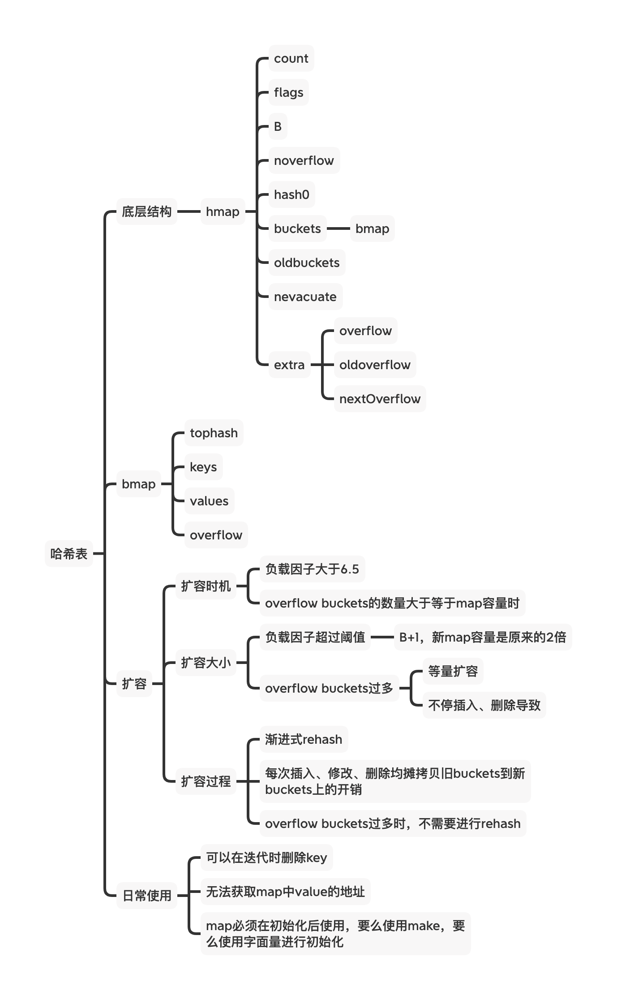

# Go Map 源码学习



## 结构体

### `hmap` 结构体

```go
type hmap struct {
	// Note: the format of the hmap is also encoded in cmd/compile/internal/gc/reflect.go.
	// Make sure this stays in sync with the compiler's definition.
	count     int // # live cells == size of map.  Must be first (used by len() builtin)
	flags     uint8
	B         uint8  // log_2 of # of buckets (can hold up to loadFactor * 2^B items)
	noverflow uint16 // approximate number of overflow buckets; see incrnoverflow for details
	hash0     uint32 // hash seed

	buckets    unsafe.Pointer // array of 2^B Buckets. may be nil if count==0.
	oldbuckets unsafe.Pointer // previous bucket array of half the size, non-nil only when growing
	nevacuate  uintptr        // progress counter for evacuation (buckets less than this have been evacuated)

	extra *mapextra // optional fields
}
```

字段意义：

- `count`: map中现有的元素个数；对应我们使用len()函数后的结果
- `flags`: 用于标记当前 hmap正在做什么；
- `B`: hmap容量的幂；hmap可以容纳 loadFactor * 2 ^ B 个元素
- `noverflow`:  overflow bucket 的个数
- `hash0`: 哈希种子，用于为哈希函数引入随机性
- `buckets`: 2 ^ B 个bmap 数组，当count == 0 时可能为nil；
- `oldbuckets`: 扩容时才有用，用于存放尚未被rehash到新bucket中的元素
- `nevacutate`: 记录扩容进度；
- `extra`: 

### `bmap` 结构体

```go
type bmap struct {
	// tophash generally contains the top byte of the hash value
	// for each key in this bucket. If tophash[0] < minTopHash,
	// tophash[0] is a bucket evacuation state instead.
	tophash [bucketCnt]uint8
	// Followed by bucketCnt keys and then bucketCnt elems.
	// NOTE: packing all the keys together and then all the elems together makes the
	// code a bit more complicated than alternating key/elem/key/elem/... but it allows
	// us to eliminate padding which would be needed for, e.g., map[int64]int8.
	// Followed by an overflow pointer.
}
```

`bmap` 定义中只有一个tophash字段，是一个[8]uint8 类型的数组，里面存放了当前bucket的key的高8位值；通过这个tophash，可以快速判断key是否在该bucket中；

紧接着这个数组，会存入对应的8个key(或empty)和8个value(或empty)；再接着是一个指向overflow bucket的指针；如下图所示：

### `mapextra` 结构体

```go
type mapextra struct {
	// If both key and elem do not contain pointers and are inline, then we mark bucket
	// type as containing no pointers. This avoids scanning such maps.
	// However, bmap.overflow is a pointer. In order to keep overflow buckets
	// alive, we store pointers to all overflow buckets in hmap.extra.overflow and hmap.extra.oldoverflow.
	// overflow and oldoverflow are only used if key and elem do not contain pointers.
	// overflow contains overflow buckets for hmap.buckets.
	// oldoverflow contains overflow buckets for hmap.oldbuckets.
	// The indirection allows to store a pointer to the slice in hiter.
	overflow    *[]*bmap
	oldoverflow *[]*bmap

	// nextOverflow holds a pointer to a free overflow bucket.
	nextOverflow *bmap
}
```


## 扩容

随着逐渐往map中插入元素，空间逐渐占满；或者插入的元素key冲突过多，overflow buckets过多，导致查找效率变低，会触发map的扩容，下面就来看看hmap扩容的条件和过程。

### 扩容时机

引发hmap进行扩容的有以下两种情况：（首先的条件是当前hmap没有在扩容，通过`nevacuate` 来判断）

1. 负载因子(`loadFactor`) 超过阈值 6.5；loadFactor = count / 2 ^ B(装满的情况下是8)
2. `tooManyOverflowBuckets()` 函数返回`true`，也就是当`overflow buckets`数量大于等于hmap的容量时；

上面通过两个维度（整体map情况和map冲突情况）来判断是否需要扩容。

下面我们分别看看这两种条件的判断代码。

#### 负载因子超过阈值


#### 冲突情况严重

### 扩容大小

### 扩容过程

## 日常使用

## 参考文档

1. https://smartkeyerror.oss-cn-shenzhen.aliyuncs.com/Phyduck/golang/map.pdf
2. 