# Raft算法学习

分布式一致性是构建容错系统的基础，它使得一些机器可以构成集群工作，并容许其中一些节点失效。当前最主要的一致性算法有Paxos和Raft。可查看[Raft 可视化](https://raft.github.io/) 。

Raft是一个管理replicated log的算法，下图是Raft算法的核心内容：

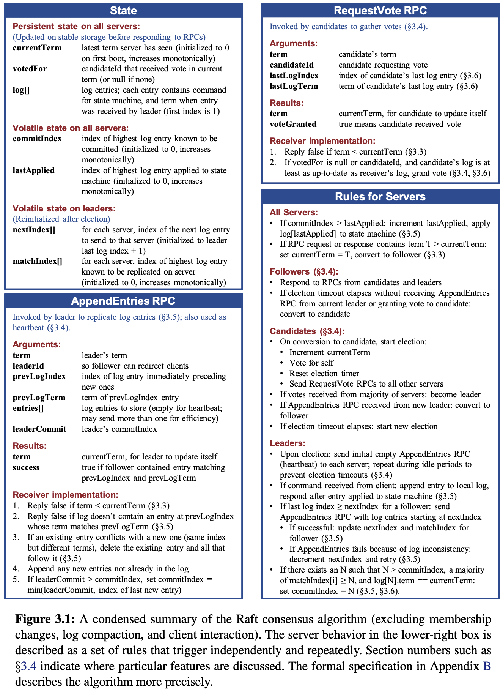

下图列出来Raft算法的关键特性：

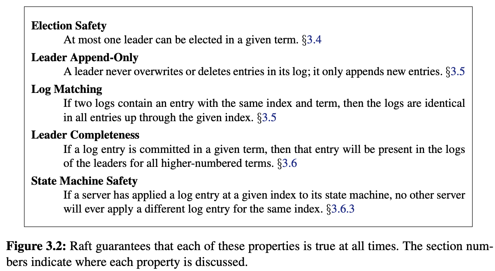

Raft首先会选举出一台机器作为Leader，然后让系统所有的决定都由Leader来处理，这两步操作是相对独立的。

Raft通过投票和随机超时来选举Leader，选举保证Leader存有所有必要的信息。因此数据只能从Leader流向其它节点。

下面将会详细介绍Raft的算法的详细内容:

## 1. 目标

- 可以支持实现一个完整的系统，需要极大的减少开发者的设计工作；
- 必须在任何条件下都能保证安全和可用性；
- 必须效率足够高；

## 2. 角色

- Leader：接受客户端请求，并向Follower同步请求日志；当日志同步到大多数服务后，Leader告诉Follower提交日志；
- Follower：接收并持久化Leader同步来的日志，在Leader告知日志可提交后，提交日志；
- Candidate：中间状态，Leader选举过程中的临时角色；

角色之间的转换如下图所示：


## 3. 子问题

### 3.1 Leader选举

#### 3.1.1 term(任期)

Raft将时间划分为任意长度的term，用连续整数编号。每一个term都从选举开始，一个或多个candidate想要成为leader，如果一个candidate赢得选举，它将会在剩余的term中作为leader。

特殊情况下，选票被瓜分，导致没有leader，则这个term无法选举出leader，那将会很快进入下一个term。如下图所示：

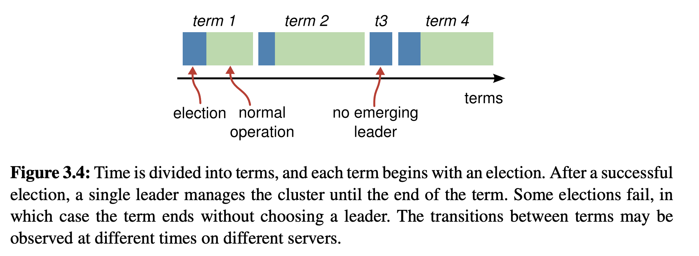

Raft使用心跳机制来触发leader选举，选举的具体步骤如下：

1. 服务启动初始角色为follower

2. 基于heartbeat触发，若无leader heartbeat或者candidate的有效RPC请求，触发选举；否则保持follower状态；

3. 提高自己的term(任期)；

  - 每触发一次选举任期+1

4. 服务角色转为candidate，给自己投票，发送RequestVote RPC给其他服务器；

5. 等待Vote响应（每隔server在给定的term内至多只能投票给一个candidate，先到先得）；

6. 有3中情况：

  1. 自己当选：成为leader，发送心态消息告诉其他server，并阻止新的选举；
  2. 其它服务当选：收到其他server的的心跳或AppendEntries RPC，若term大于等于自己的term，转换为follower；否则拒绝该leader的请求，维持candidate状态；
  3. 无服务当选：从第3步开始重新执行；

  

### 3.2 日志同步

当完成leader选举后，leader就可以开始为客户端服务了。

下面是具体的日志同步的步骤：

1. Leader 接受请求，把请求作为Log Entries追加入自己的日志中；
2. 并行发送AppendEntries RPC到Follower，复制日志；
3. 当复制到大多数服务，Leader将该Log Entries应用到状态机，并返回执行结果
4. Leader会无限重试AppendEntries RPC给那些尚未成功复制日志的服务，直到所有的follower最终都存储了相同的日志；

#### 3.2.1 日志组成

- 日志有序编号log index
- term 任期号
- 命令

如下图所示：

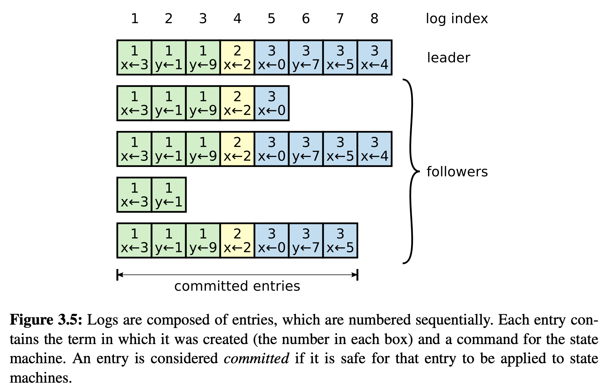

### 3.2.2 同步约束

- 1. 一个term内，给定一个log index最多创建一条log entry，该条目在日志的位置不会改变
- 2. follower接受AppendEntries RPC时，会检查之前的日志中log index和term与请求中的进行比较，拒绝不一致的复制请求；

### 3.2.3 不一致时处理方法

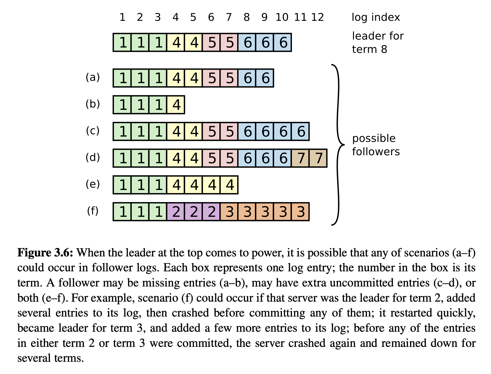

Raft中follower的日志可能会如上图所示，出现多种情况，具体总结为如下两种。

- follower丢失

	- 无限重试复制日志

- follower多余

	- 从后往前，找到一致记录，进行覆盖

## 3.3 安全性

前面讲了leader选举和日志同步，但这些机制还不能充分确保每一个状态机都以相同的顺序执行相同的指令。

Raft通过在选举过程中增加一些限制来实现：

1. 包含全部的committed的log entry的candidate才有资格成为leader；
2. candidate节点必须得到大多数server的投票才能赢得选举；
3. Leader只能推进commit index来提交当前term中已复制到大多数服务的日志。旧term日志的提交要等到提交当前term的日志来间接提交

如下图所示：（特别注意c中2的提交，他是在4提交时被动提交的）

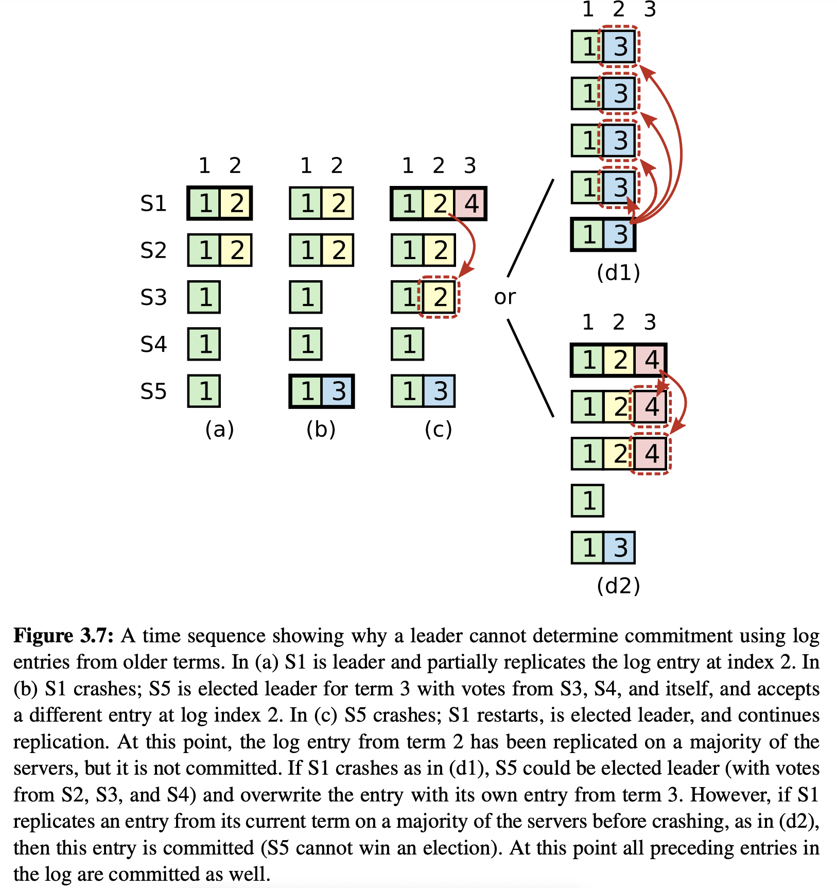

### 3.3.1 持久化

必须持久化

- term和投出的选票：防止一个term投出两次选票；
- Commit最新的日志：防止committed日志丢失；

可选持久化：

- 状态机：若不持久化，则需要重新apply日志；若持久化，也需要持久化保存最后apply的index，避免重复apply；

### 3.3.2 时间语义与可用性

Raft安全性的一项要求是它不依赖于精确的时间，然而，可用性却不可避免的依赖于时间。Leader选举是Raft对时间最敏感的部分，当满足下面的公式时，Raft可以选出并保持一个稳定的leader：

```
broadcastTime << electionTimeout << MTBF(<< 标识远小于)
```

- `broadcastTime`: 节点并行想其它所有节点并行发送RPC请求并获得响应的平均时间；
- `electionTimeout`: 选举超时时间；
- `MTBF`:单个节点两次宕机间隔的平均时间；

`broadcastTime` 远小于 `electionTimeout`，这样leader可以依靠心态来组持follower发起选举；

`electionTimeout`引入随机性，可以避免选票被瓜分；

`electionTimeout` 远小于 `MTBF`，可以保持系统平稳工作；

## 4 日志压缩

Raft日志会随着不断处理客户端的请求而变大，会占用越来越多的空间而且重放日志也需要更多的时间。如果不采取一些压缩日志的方式，最终会造成一些可用性的问题：机器可能会耗尽空间，或者话花费太多的时间来重启。因此对于实际系统来说日志压缩是必须的。

下图是Raft状态机不同的日志压缩实现方式：

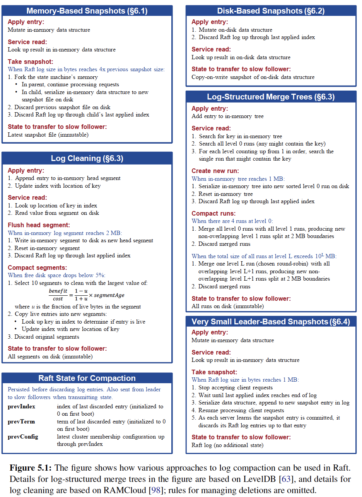

- snapshot

	- 日志元数据
	- 系统状态

## 5 成员变更

前面的讨论都是基于集群的server不变的情况，但在实际情况下，我们通常需要上线或者下线server，这就是成员变更。Raft实现了自动更新配置机制。

下图是成员变更中相关的RPC请求：

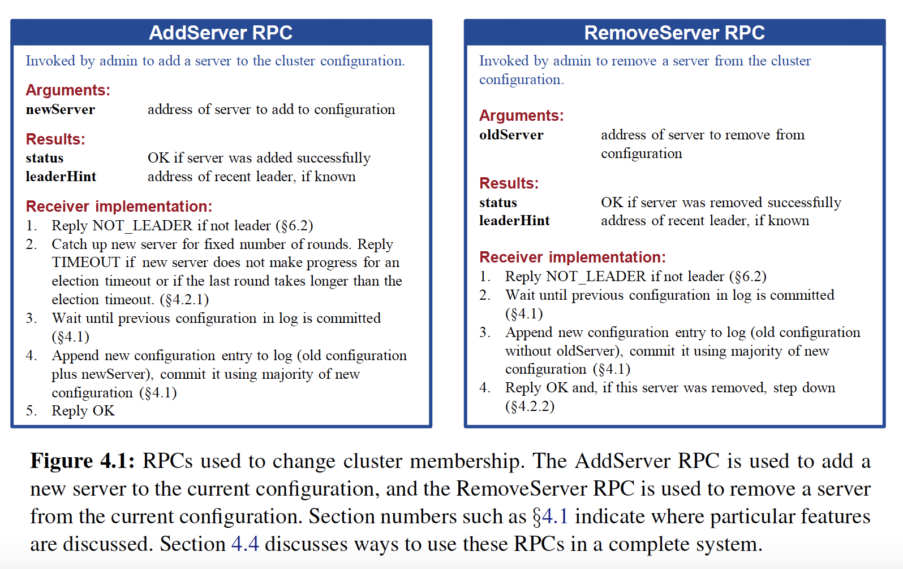

### 5.1 更新期间安全性保证

成员变更期间，必须确保在同一个term中不会有两个leader被选举出来，如果直接更新配置，增加或删除集群中的servers，直接将集群从旧的配置更新到新的配置是不安全的。可能会出现两个leader。不可能一次性完成所有节点的转换。

如下图：


Raft对配置更新的操作进行了限制：集群在某一时刻只能添加或删除一台机器。

复杂的多台机器的配置更新可以通过逐个执行上述操作来实现。

如下图所示，老的集群节点形成的多数派和新集群节点形成的多数派，必然发生重叠，也就是说必然只能形成一个多数派，这个重叠避免了脑裂。因此只添加或删除一个节点时，可以直接更新配置。

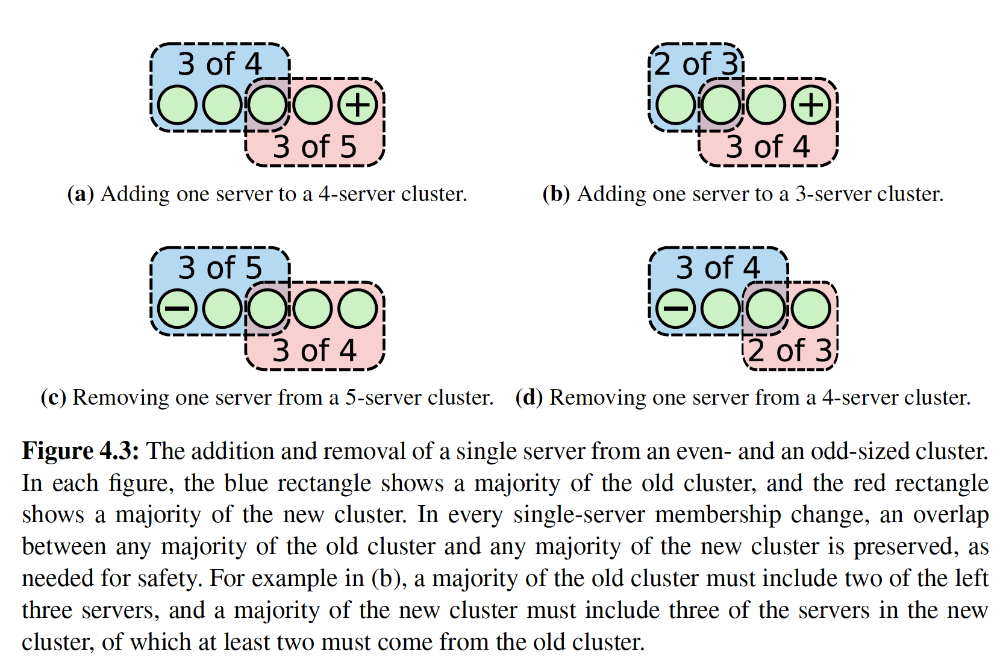

步骤：

1. leader收到一个让其从现有配置C_old增加或删除一个节点；
2. leader向日志中追加一条含有新配置信息的C_new的log entry；
3. leader向其它serve(C_new server)r并行发送log entry；
4. 其他server应用该log entry;
5. 大部分节点应用了新配置，leader commit；

### 5.2 更新期间的可用性

#### 5.2.1 新server日志同步

当一个新server被添加到集群中时，它通常没有存储任何日志信息，需要花费一定时间才能追上leader的日志进度，在这期间集群容易出现不可用。

Raft在配置更新时，新加入的节点不占有投票权，leader会将日志复制给它，但在选举或者commit时统计多数选票时不会计入。当新节点的日志追上后，才更新配置。

Raft使用下面的算法来确保新server的日志可以充分追上leader：将对新节点的复制日志过程划分为几轮，每一轮复制从开始到现在的所有日志给新节点，由于在复制日志的过程中，leader会继续接收新的日志，这些新加的日志会在下一轮进行复制，随着不断的进行，每一轮次复制的持续时间会不断缩短，当算法等待几个轮次(比如10)的复制之后，如果最后一轮的持续时间短于election timeout，leader就可以将新节点正式加入集群，否则leader就会中断配置更新并返回错误，调用者之后可以进行重试（下次重新更有可能成功，因为该节点的日志已经部分赶了上来）。

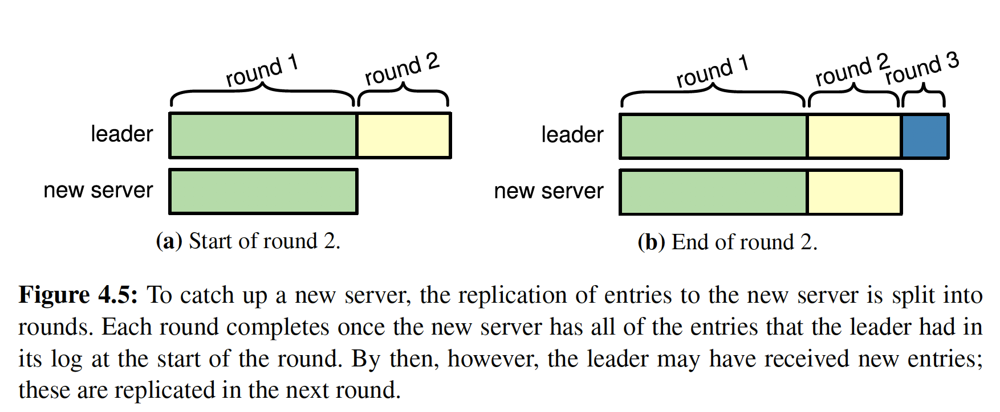

#### 5.2.2 移除当前leader

1. 使用领导权主动转移的扩展；通过发送所有committer日志和转移日志给某个人server来实现；
2. 被移除的leader在新配置C_new被commit之后下线；

#### 5.2.3 破坏性servers

不处于新配置的节点可能会毁坏整个集群。

不再新配置中的节点不会收到心态信息，因此它可能会超时开始新的选举，而且它将不会接收到新配置和新配置commit的消息，它也将不会知道自己被移除集群。

它将会以新的term发送RequestVote RPC，并使得其他的leader被迫转为follower。处于新配置下的一个节点最终会成为leader，但是这个待下线节点将会再次超时并形成恶性循环。如果要下线的节点更多，情况将会更严重。

Raft的解决办法是使用心跳来判断是否有一个有效的leader存在，如果leader可以持续的发送心跳那就认为leader是活跃的。因此节点可以收到心跳时是不可以打断leader的。我们修改一下RequestVote RPC：如果节点在心跳超时之前收到了RequestVote请求，它不会提升自己的term。它可以丢弃该请求或者返回一个拒绝投票的请求，或者推迟这个请求，结果都是相同的。这不会影响正常的选举，这却保证了leader不会被迫下线。

## 6. 客户端交互

下图是客户端交互相关的RPC方法：

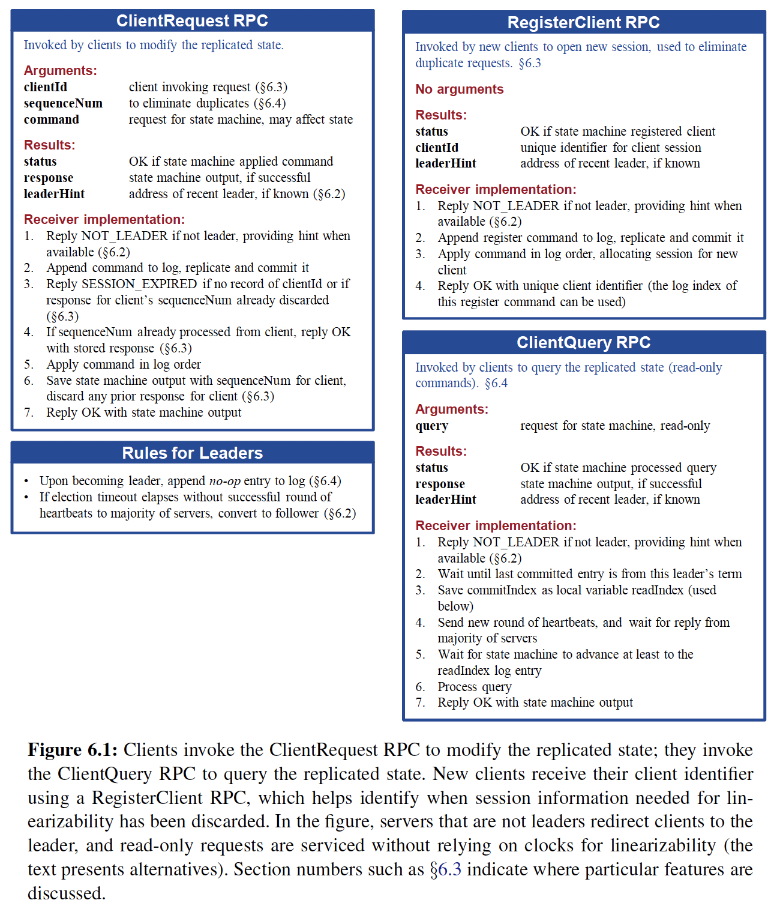

精确一次语义实现：

1. 为每一个客户端分配一个UID；
2. 客户端的每个命令分配一个序号ID；
3. leader对每一个client维护一个session

在同一个session中，若UID和命令序号ID对应的命令已被执行，则直接返回响应；若未执行，则直接执行；

客户端若未收到响应，则不断重发命令；

参考文档：

https://docs.qq.com/doc/DY0VxSkVGWHFYSlZJ
