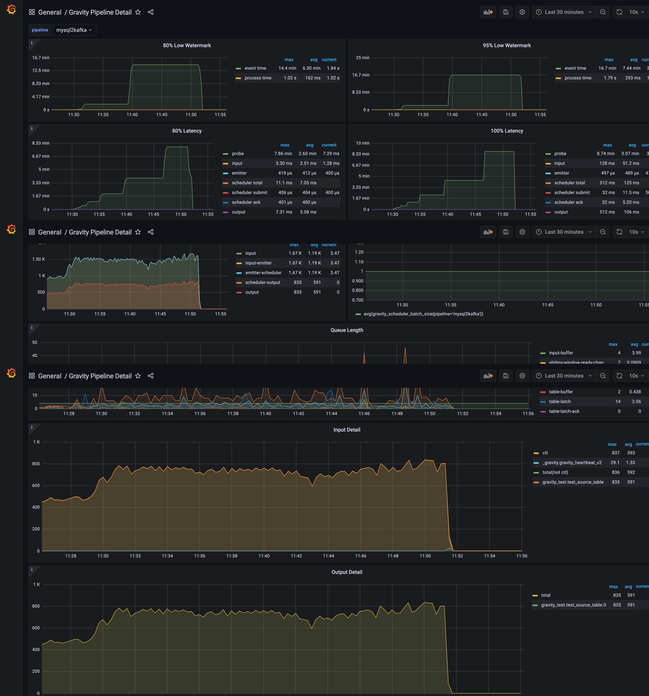

# Gravity 学习

## 概述

### 简介

数据复制组件，提供全量、增量数据同步，以及向消息队列发布数据更新。

### 目标

- 支持多种数据源和目标的，可灵活定制的数据复制组件
- 支持基于 Kubernetes 的 PaaS 平台，简化运维任务

### 使用场景

- MySQL Binlog => MySQL/Kafka
- Mongo Oplog => Kafka

### 数据处理支持

- 数据过滤
- 重命名列
- 删除列

## 架构

### 架构图


### 组件功能

- `Input`: 适配各种数据源
- `Filter`: 对`Input`生成的数据流做数据变换工作
- `Output`: 将数据写入目标存储系统；
- `Scheduler`: 数据流调度和支持同一行数据的修改有序
- `Matcher`: 匹配`Input` 生成的数据流
- `Router`: 对 `Output` 进行定制化路由

## 配置

### Mysql => Kafka

mysql 对源端 MySQL 的要求如下：

- 开启 gtid 模式的 binlog
- 创建 gravity 账户，并赋予 replication 相关权限，以及 _gravity 数据库的所有权限
- MySQL 源端、目标端相应的表需要创建好；

```toml
[mysqld]
server_id=4
log_bin=mysql-bin
enforce-gtid-consistency=ON
gtid-mode=ON
binlog_format=ROW
```


gravity 账户权限如下所示

```sql
CREATE USER _gravity IDENTIFIED BY 'xxx';
GRANT SELECT, RELOAD, LOCK TABLES, REPLICATION SLAVE, REPLICATION CLIENT, CREATE, INSERT, UPDATE, DELETE ON *.* TO '_gravity'@'%';
GRANT ALL PRIVILEGES ON _gravity.* TO '_gravity'@'%';
```

#### 增量

```toml
[input]
type = "mysql"
mode = "stream"

[input.config]
# 是否忽略双向同步产生的内部数据，默认值为 false
ignore-bidirectional-data = false

#
# 源端 MySQL 的连接配置
# - 必填
#
[input.config.source]
host = "127.0.0.1"
username = "_gravity"
password = ""
port = 3306
max-open = 20 # 可选，最大连接数
max-idle = 20 # 可选，最大空闲连接数，建议与 max-open 相同

#
# 开始增量同步的起始位置。
# - 默认为空，从当前 gtid 位点开始同步
# - 可选
# - gravity会在mysql中创建存储同步信息的库：gravity
[input.config.start-position]
binlog-gtid = "abcd:1-123,egbws:1-234"

#
# 源端 MySQL 心跳检测的特殊配置。若源端 MySQL 的心跳检测（写路径）与 [input.mysql.source]
# 不一样的话，可以在此配置。
# - 默认不配置此项。
# - 可选
#
[input.config.source-probe-config]
annotation = "/*some_annotataion*/"
[input.config.source-probe-config.mysql]
host = "127.0.0.1"
username = "_gravity"
password = ""
port = 3306
```

增量性能测试：

- gravity环境：1CPU，4G（开了2个进程）；cpu在11:40后处于100%；
- mysql和kafka环境：2C4G，同一台机器，kafka是单节点，单replica；
- 数据准备：持续写入，不断提高写入速率

（第三行的图是event per second 和 actual batch size）



#### 全量

```toml
[input]
type = "mysql"
mode = "batch"
#
# 源端 MySQL 的连接配置
# - 必填
#
[input.config.source]
host = "127.0.0.1"
username = "_gravity"
password = ""
port = 3306

#
# 源端 MySQL 从库的配置
# 如果有此配置，则扫描数据时优先从从库扫描
# - 默认不配置此项
#
[input.config.source-slave]
host = "127.0.0.1"
username = "_gravity"
password = ""
port = 3306

#
# 需要扫描的表
# - 必填
[[input.config.table-configs]]
schema = "test_1"
table = "test_source_*"

[[input.config.table-configs]]
schema = "test_2"
table = "test_source_*"
# - 可选
# 指定扫描的列名字。默认情况下，如果不指定的话，系统会自动探测唯一键作为扫描的列。
# 请仔细核对这个配置，确保这个列上面有唯一索引。
scan-column = "id"

# ignore-tables 定义了扫描时忽略的表

# 定义 ignore-tables 可以忽略这些错误
[[input.config.ignore-tables]]
schema = "test_1"
table = "test_source_1"


[input.config]
# 总体扫描的并发线程数
# - 默认为 10，表示最多允许 10 个表同时扫描
# - 可选
nr-scanner = 10

# 单次扫描所去的行数
# - 默认为 10000，表示一次拉取 10000 行
# - 可选
table-scan-batch = 10000

# 全局限制，每秒所允许的 batch 数
# - 默认为 1
# - 可选
#
batch-per-second-limit = 1

# 全局限制，没有找到单列主键、唯一索引时，最多多少行的表可用全表扫描方式读取，否则报错退出。
# - 默认为 100,000
# - 可选
#
max-full-dump-count = 10000
```

#### 增量+全量

```toml
[input]
type = "mysql"
mode = "replication"
```

其余设置分别于全量、增量相同。 系统会先保存起始位点，再执行全量。若表未创建，会自动创建表结构。全量完成后自动从保存的位点开始增量。

##### 性能测试

- gravity环境：1CPU，4G（CPU在40左右）
- mysql和kafka环境：2C4G，同一台机器，kafka是单节点，单replica；
- 数据量：第一次全量30万记录，10万增量；第二次；40万全量记录，10万增量

（第三行图是event per second 和 actual batch size；两个波峰是开启任务，进行全量的过程，启动任务同时也开启了增量写入）


## 定制化支持

### 多任务管理

测试开多个进程，对应同一个配置文件，拷贝数据是多份；（内部实现通过在mysql记录任务的同步偏移，会从偏移处开始同步，多个相同任务会从同一个位置开始同步，同步多份数据）

可以配置多个任务（任务名称需要不一样），对应多个配置文件和多个数据表，实现多任务管理；

### 数据源筛选

- 支持配置数据库、数据表、列过滤；

```toml
# 需要扫描的表
# - 必填
[[input.config.table-configs]]
schema = "test_1"
table = "test_source_*"

[[input.config.table-configs]]
schema = "test_2"
table = "test_source_*"
# - 可选
# 指定扫描的列名字。默认情况下，如果不指定的话，系统会自动探测唯一键作为扫描的列。
# 请仔细核对这个配置，确保这个列上面有唯一索引。
scan-column = "id"

# ignore-tables 定义了扫描时忽略的表

# 定义 ignore-tables 可以忽略这些错误
[[input.config.ignore-tables]]
schema = "test_1"
table = "test_source_1"
```

## 总结

- 不支持分布式，但可以配置多任务，同步不同的库/表，并路由到相同topic或不同topic；
- 增量性能，1C情况下，平均1.19k/s
- 全量性能，1C情况下，平均1.16k/s；最高19.5k/s，全量的性能数据量越大应该还可以更高，后续继续测试；
- 在k8s上的运行暂未测试；
- 数据源支持：暂时只支持mysql/mongo，其他数据源暂不支持；