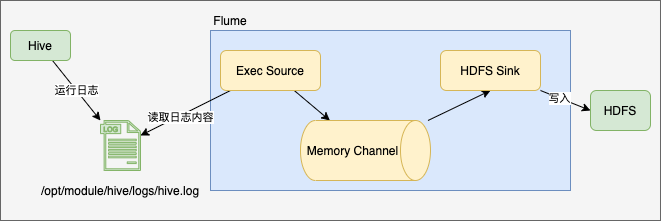
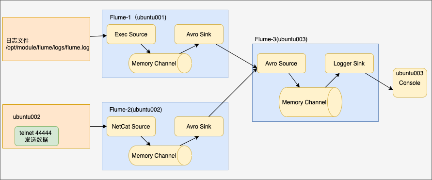

# Flume

## 1. 介绍

### 1.1 Flume是什么

`Flume` 是一个分布式的、高可靠的、高可用的对海量日志数据进行采集、聚合和传输的系统。它架构灵活简单，基于流式数据流；使用简单灵活的数据模型，非常适合在想分析应用。

`Flume` 不是只能用在日志的聚合上，由于数据源插件可以自定义实现，`Flume` 也可以被用在如网络数据、社交媒体信息、邮件信息等等多种事件数据上。

### 1.2 Flume架构


#### 1.2.1 组件介绍

- `Agent` : 一个 `JVM` 进程，以事件的形式将数据从数据源送到目的地，是 `Flume` 数据传输的基本单元；
- `Source`: 负责将数据从数据源接入到 `Agent` 组件，`Source` 可以处理各种类型、各种格式的数据，包括 `avro`、`thrift`、`exec`、`jms`、`spooling directory`、`netcat`、`sequence generator`、 `syslog`、`http`、`legacy`。也支持自定义处理程序；
- `Channel`: 介于 `Source` 和 `Sink` 之间的缓冲区，用于调节 `Source` 和 `Sink` 之间的数据流动速率。`Flume` 自带两个 `Channel`: 
  - `Memory Channel`: 内存队列，程序崩溃或机器宕机时会丢失数据；
  - `File Channel`: 文件队列，不会丢失数据，但涉及到磁盘读写；
- `Sink`: `Sink` 不断地轮询 `Channel` 中的事件且批量地移除它们，并将这些事件批量写入到存储或索引系统；或者被发送到另一个 `Flume Agent`。`Sink` 是完全事务性的。在从 `Channel` 批量删除数据之前，每个 `Sink` 用 `Channel` 启动一 个事务。批量事件一旦成功写出到存储系统或下一个 `Flume Agent`，`Sink` 就用 `Channel` 提交事务。事务一旦被提交，该 `Channel` 从自己的内部缓冲区删除事件。`Sink` 组件目的地包括 `hdfs`、 `logger`、 `avro`、 `thrift`、`ipc`、`file`、`null`、`HBase`、`solr`、`自定义`。

### 1.3 `Flume` 常见拓扑结构

#### 1.3.1 顺序流

多个 `Agent` 按顺序传输数据


#### 1.3.2 聚合流

多个 `Agent` 收集数据，最后汇总到下一个 `Agent`，由它将汇总数据到存储系统


#### 1.3.3 复用流

将数据传输到多个目的地，如备份需求或者是不同业务上的需求。


## 2. 安装

- 下载 `Flume`: [apache-flume-1.9.0-bin.tar.gz](http://www.apache.org/dyn/closer.lua/flume/1.9.0/apache-flume-1.9.0-bin.tar.gz)

- 解压

  ```sh
   tar xzf apache-flume-1.9.0-bin.tar.gz -C /opt/module
  ```

- 修改配置，在 `flume-env.sh` 添加 `JAVA_HOME` 配置

  ```sh
  cd /opt/module/ && mv mv apache-flume-1.9.0-bin/ flume
  cd flume/conf/ && mv flume-env.sh.template flume-env.sh
  ```

  ```sh
  export JAVA_HOME=/opt/module/jdk1.8.0_281
  ```

## 3. 实践

### 3.1 第一个用例

* 创建 `example.conf` 文件，输入如下内容

  ```conf
  # example.conf: A single-node Flume configuration
  
  # Name the components on this agent
  a1.sources = r1
  a1.sinks = k1
  a1.channels = c1
  
  # Describe/configure the source
  a1.sources.r1.type = netcat
  a1.sources.r1.bind = localhost
  a1.sources.r1.port = 44444
  
  # Describe the sink
  a1.sinks.k1.type = logger
  
  # Use a channel which buffers events in memory
  a1.channels.c1.type = memory
  a1.channels.c1.capacity = 1000
  a1.channels.c1.transactionCapacity = 100
  
  # Bind the source and sink to the channel
  a1.sources.r1.channels = c1
  a1.sinks.k1.channel = c1
  ```

* 启动 `flume agent`

  ```sh
  bin/flume-ng agent --conf conf --conf-file jobs/flume-telnet-logger.conf --namename a1 -Dflume.root.logger=INFO,console
  ```

* 运行 `telnet`, 输入数据

  ```sh
  telnet 127.0.0.1 44444
  Trying 127.0.0.1...
  Connected to 127.0.0.1.
  Escape character is '^]'.
  hello
  OK
  world
  OK
  fuck
  OK
  ```

  ​	可以看到，在 `Flume agent` 上会打印对应的消息

  ```sh
  2021-04-09 08:08:40,881 (SinkRunner-PollingRunner-DefaultSinkProcessor) [INFO - org.apache.flume.sink.LoggerSink.process(LoggerSink.java:95)] Event: { headers:{} body: 68 65 6C 6C 6F 0D                               hello. }
  2021-04-09 08:08:51,342 (SinkRunner-PollingRunner-DefaultSinkProcessor) [INFO - org.apache.flume.sink.LoggerSink.process(LoggerSink.java:95)] Event: { headers:{} body: 77 6F 72 6C 64 0D                               world. }
  2021-04-09 08:08:56,077 (SinkRunner-PollingRunner-DefaultSinkProcessor) [INFO - org.apache.flume.sink.LoggerSink.process(LoggerSink.java:95)] Event: { headers:{} body: 66 75 63 6B 0D                                  fuck. }
  ```

* 数据流

  

### 3.2 `flume-ng` 命令参数解析

```sh
--conf conf/ # 表示配置文件存储在 conf/目录
--name a1 # 表示给 agent 起名为 a1
--conf-file example.conf # 本次启动读取的配置文件为example.conf
-Dflume.root.logger==INFO,console # -D 表 示 flume 运 行 时 动 态 修 改flume.root.logger 参数属性值，并将控制台日志打印级别设置为 INFO 级别。日志级别包括:log、 info、warn、error。
```

### 3.3 配置文件解析

`Flume` 的配置文件由5个部分组成：

* `Agent` 包含的组件的名称定义，包括 `Source`、`Channel`、`Sink`
*  `Source`、`Channel`、`Sink` 各自的定义
* `Source`、 `Sink` 与 `Channel` 的绑定关系

### 3.4 Source

`Flume`支持多种多样的 `Source`，如 `Avro` / `Thrift` / `Exec` / `JMS` / `Spooling Directory` / `Taildir` / `Kafka` / `NetCat` / `Syslog` / `HTTP` / `自定义` 等；具体可参考链接：[Flume Source](https://flume.apache.org/releases/content/1.9.0/FlumeUserGuide.html#flume-sources)

### 3.5 Channel

`Channel` 是 `Flume` 上存储事件的仓库，`Source` 负责添加事件，`Sink`则删除事件。`Flume` 支持的 `Channel` 有 `Memory` / `JDBC` / `Kafka` / `File` / `Splillable Memory` / ` 自定义 ` 等等；具体可参考链接： [Flume Channels](https://flume.apache.org/releases/content/1.9.0/FlumeUserGuide.html#flume-channels) 

### 3.6 Sink

`Flume` 支持多种多样的 `Sink`，如 `HDFS` / `Hive` / `Logger` / `Avro` / `Thrift` / `HBase` / `ElasticSearch` / `Kafka` / `HTPP` / `自定义` 等等 ；具体可参考链接：[Flume Sinks](https://flume.apache.org/releases/content/1.9.0/FlumeUserGuide.html#flume-sinks)

### 3.7 实践

#### 3.7.1 监控 Hive 日志，并上传到 HDFS

- 数据流

  

- 配置文件

  ```conf
  a1.sources = r1
  a1.channels = c1
  a1.sinks = k1
  
  # source
  a1.sources.r1.type = exec
  a1.sources.r1.command = tail -F /opt/module/hive/logs/hive.log
  a1.sources.r1.shell = /bin/bash -c
  
  # sink
  a1.sinks.k1.type = hdfs
  a1.sinks.k1.hdfs.path = hdfs://ubuntu001:9000/user/hive/warehouse/flume/%Y%m%d/%H
  a1.sinks.k1.hdfs.useLocalTimeStamp = true
  
  # channel
  a1.channels.c1.type = memory
  a1.channels.c1.capacity = 1000
  a1.channels.c1.transactionCapacity = 100
  
  
  # binding
  a1.sources.r1.channels = c1
  a1.sinks.k1.channel = c1
  ```

- 执行 `flume-ng` (需要替换 `guava`的JAR包)

  ```sh
   bin/flume-ng agent --conf conf/ --name a1 --conf-file jobs/hivelog-to-hdfs.conf
  ```

- 运行 `Hive` 和查看 `HDFS` 上的文件

  ```sh
  cd /opt/module/hive && bin/hive
  hdfs dfs -ls -R /user/hive/warehouse/flume
  ```

#### 3.7.2 实时读取目录文件到 HDFS

- 数据流

  

- 配置文件

  ```conf
  a1.sources = r1
  a1.sinks = k1
  a1.channels = c1
  
  #source
  a1.sources.r1.type = spooldir
  a1.sources.r1.spoolDir = /opt/module/flume/upload
  a1.sources.r1.ignorePattern = ([^ ]*\.tmp)
  a1.sources.r1.fileHeader = true
  
  #sink
  a1.sinks.k1.type = hdfs
  a1.sinks.k1.hdfs.path = hdfs://ubuntu001:9000/user/hive/warehouse/flume-upload/%Y%m%d/%H
  a1.sinks.k1.hdfs.useLocalTimeStamp = true
  
  #channel
  a1.channels.c1.type = memory
  a1.channels.c1.capacity = 1000
  a1.channels.c1.transactionCapacity = 100
  
  # bind
  a1.sources.r1.channels = c1
  a1.sinks.k1.channel = c1
  ```

  

- 执行 `flume-ng`

  ```sh
  bin/flume-ng agent --conf conf/ --name a1 --conf-file jobs/upload-to-hdfs.conf
  ```

- 创建目录与文件 和查看 `HDFS` 上的文件

  ```sh
  cd /opt/module/flume && mkdir upload
  touch upload/f.tmp && touch upload/f.log && touch upload/f.txt
  hdfs dfs -ls -R /user/hive/warehouse/flume-upload
  ```

#### 3.7.3 单 Source 多Channel和多Sink实例

- 案例描述：使用flume-1监控 `/opt/module/hive/logs/hive.log` 文件变化，然后分别传送给 `flume-2` 和 `flume-3`; `flume-2`负责将数据写入 `HDFS`, `flume-3` 负责将数据写入本地文件系统

- 数据流

  

- 配置文件

  ```conf
  # flume-1.conf
  # name
  a1.sources = r1
  a1.sinks = k1 k2
  a1.channels = c1 c2
  
  
  #source
  a1.sources.r1.selector.type = replicating
  
  a1.sources.r1.type = exec
  a1.sources.r1.command = tail -F /opt/module/hive/logs/hive.log
  a1.sources.r1.shell = /bin/bash -c
  
  # sinks
  a1.sinks.k1.type = avro
  a1.sinks.k1.hostname = ubuntu001
  a1.sinks.k1.port = 4141
  
  a1.sinks.k2.type = avro
  a1.sinks.k2.hostname = ubuntu001
  a1.sinks.k2.port = 4142
  
  #channels
  a1.channels.c1.type = memory
  a1.channels.c1.capacity = 1000
  a1.channels.c1.transactionCapacity = 100
  
  a1.channels.c2.type = memory
  a1.channels.c2.capacity = 1000
  a1.channels.c2.transactionCapacity = 100
  
  # bind
  a1.sources.r1.channels = c1 c2
  a1.sinks.k1.channel = c1
  a1.sinks.k2.channel = c2
  ```

  ```conf
  # flume-2.conf
  # name
  a2.sources = r2
  a2.sinks = k2
  a2.channels = c2
  
  # source
  a2.sources.r2.type = avro
  a2.sources.r2.bind = ubuntu001
  a2.sources.r2.port = 4141
  
  # sink
  a2.sinks.k2.type = hdfs
  a2.sinks.k2.hdfs.path = hdfs://ubuntu001:9000/user/hive/warehouse/multi-channels-sinks/%Y%m%d/%H
  a2.sinks.k2.hdfs.useLocalTimeStamp = true
  
  # channel
  a2.channels.c2.type = memory
  a2.channels.c2.capacity = 1000
  a2.channels.c2.transactionCapacity = 100
  
  # bind
  a2.sources.r2.channels = c2
  a2.sinks.k2.channel = c2
  
  ```

  ```conf
  # flume-3.conf
  # name
  a3.sources = r3
  a3.sinks = k3
  a3.channels = c3
  
  # source
  a3.sources.r3.type = avro
  a3.sources.r3.bind = ubuntu001
  a3.sources.r3.port = 4142
  
  # sink
  a3.sinks.k3.type = file_roll
  a3.sinks.k3.sink.directory = /opt/module/datas/flume3
  
  # channel
  a3.channels.c3.type = memory
  a3.channels.c3.capacity = 1000
  a3.channels.c3.transactionCapacity = 100
  
  # bind
  a3.sources.r3.channels = c3
  a3.sinks.k3.channel = c3
  ```

  

- 执行 `flume-ng`

  ```sh
  mkdir -p /opt/module/datas/flume3
  bin/flume-ng agent --conf conf/ --name a3 --conf-file jobs/multi-channels-sinks/flume-3.conf
  bin/flume-ng agent --conf conf/ --name a2 --conf-file jobs/multi-channels-sinks/flume-2.conf
  bin/flume-ng agent --conf conf/ --name a1 --conf-file jobs/multi-channels-sinks/flume-1.conf
  ```

- 启动 `Hive` 和查看对应文件

  ```sh
  bin/hive
  cat /opt/module/datas/flume3/*
  hdfs dfs -ls -R /user/hive/warehouse/multi-channels-sinks
  ```

#### 3.7.4 单Source多Sin

- 数据流

  

- 配置文件

  ```conf
  # flume-1.conf
  # name
  a1.sources = r1
  a1.sinkgroups = g1
  a1.sinks = k1 k2
  a1.channels = c1
  
  # source
  a1.sources.r1.type = netcat
  a1.sources.r1.bind = localhost
  a1.sources.r1.port = 44444
  
  a1.sinkgroups.g1.processor.type = load_balance
  a1.sinkgroups.g1.processor.backoff = true
  a1.sinkgroups.g1.processor.selector = round_robin
  a1.sinkgroups.g1.processor.selector.maxTimeOut = 10000
  
  # sinks
  a1.sinks.k1.type = avro
  a1.sinks.k1.hostname = ubuntu001
  a1.sinks.k1.port = 4141
  
  a1.sinks.k2.type = avro
  a1.sinks.k2.hostname = ubuntu001
  a1.sinks.k2.port = 4142
  
  # channel
  a1.channels.c1.type = memory
  a1.channels.c1.capacity = 1000
  a1.channels.c1.transactionCapacity = 100
  
  # bind
  a1.sources.r1.channels = c1
  a1.sinks.k1.channel = c1
  a1.sinks.k2.channel = c1
  a1.sinkgroups.g1.sinks = k1 k2
  ```

  ```conf
  # flume-2.conf
  # name
  a2.sources = r2
  a2.sinks = k2
  a2.channels = c2
  
  # source
  a2.sources.r2.type = avro
  a2.sources.r2.bind = ubuntu001
  a2.sources.r2.port = 4141
  
  # sink
  a2.sinks.k2.type = logger
  
  # channel
  a2.channels.c2.type = memory
  a2.channels.c2.capacity = 1000
  a2.channels.c2.transactionCapacity = 100
  
  # bind
  a2.sources.r2.channels = c2
  a2.sinks.k2.channel = c2
  ```

  ```conf
  # flume-3.conf
  # name
  a3.sources = r3
  a3.sinks= k3
  a3.channels = c3
  
  # source
  a3.sources.r3.type = avro
  a3.sources.r3.bind = ubuntu001
  a3.sources.r3.port = 4142
  
  # sink
  a3.sinks.k3.type = logger
  
  # channel
  a3.channels.c3.type = memory
  a3.channels.c3.capacity = 1000
  a3.channels.c3.transactionCapacity = 100
  
  # bind
  a3.sources.r3.channels = c3
  a3.sinks.k3.channel = c3
  ```

  

- 执行 `flume-ng`

  ```sh
  bin/flume-ng agent --conf conf/ --name a3 --conf-file jobs/single-source-multi-sinks/flume-3.conf -Dflume.root.logger=INFO,console
  bin/flume-ng agent --conf conf/ --name a2 --conf-file jobs/single-source-multi-sinks/flume-2.conf -Dflume.root.logger=INFO,console
  bin/flume-ng agent --conf conf/ --name a1 --conf-file jobs/single-source-multi-sinks/flume-1.conf
  ```

- 启动 `telnet localhost 44444` 进行发送消息测试

  ```sh
  telnet localhost 44444
  Trying 127.0.0.1...
  Connected to localhost.
  Escape character is '^]'.
  hello
  OK
  world
  OK
  hello
  OK
  ```

#### 3.7.7 多source汇总

- 数据流

  

- 配置文件

  ```sh
  # ubuntu001 flume-1.conf
  # name
  a1.sources = r1
  a1.sinks = k1
  a1.channels = c1
  
  # source
  a1.sources.r1.type = exec
  a1.sources.r1.command = tail -F /opt/module/hive/logs/hive.log
  a1.sources.r1.shell = /bin/bash -c
  
  # sink
  a1.sinks.k1.type = avro
  a1.sinks.k1.hostname = ubuntu003
  a1.sinks.k1.port = 4141
  
  # channel
  a1.channels.c1.type = memory
  a1.channels.c1.capacity = 1000
  a1.channels.c1.transactionCapacity = 100
  
  # bind
  a1.sources.r1.channels = c1
  a1.sinks.k1.channel = c1
  ```

  ```conf
  # ubuntu002 flume-2.conf
  # name
  a2.sources = r2
  a2.sinks = k2
  a2.channels = c2
  
  #sources
  a2.sources.r2.type = netcat
  a2.sources.r2.bind = ubuntu002
  a2.sources.r2.port = 44444
  
  # sink
  a2.sinks.k2.type = avro
  a2.sinks.k2.hostname = ubuntu003
  a2.sinks.k2.port = 4141
  
  # channel
  a2.channels.c2.type = memory
  a2.channels.c2.capacity = 1000
  a2.channels.c2.transactionCapacity = 100
  
  # bind
  a2.sources.r2.channels = c2
  a2.sinks.k2.channel = c2
  ```

  ```conf
  # ubuntu003 flume-3.conf
  # name
  a3.sources = r3
  a3.sinks = k3
  a3.channels = c3
  
  # source
  a3.sources.r3.type = avro
  a3.sources.r3.bind = ubuntu003
  a3.sources.r3.port = 4141
  
  # sink
  a3.sinks.k3.type = logger
  
  # channel
  a3.channels.c3.type = memory
  a3.channels.c3.capacity = 1000
  a3.channels.c3.transactionCapacity = 100
  
  # bind
  a3.sources.r3.channels = c3
  a3.sinks.k3.channel = c3
  ```

- 执行 `flume-ng`

  ```sh
  # ubuntu003
  bin/flume-ng agent --conf conf/ --name a3 --conf-file jobs/multi-soruces/flume-3.conf -Dflume.root.logger=INFO,console
  # ubuntu002
  bin/flume-ng agent --conf conf/ --name a2 --conf-file jobs/multi-soruces/flume-2.conf -Dflume.root.logger=INFO,console
  # ubuntu001
  bin/flume-ng agent --conf conf/ --name a1 --conf-file jobs/multi-soruces/flume-1.conf
  ```

- 测试

  ```sh
  telnet ubuntu002 44444
  bin/hive
  ```

## 4. 自定义 Source


